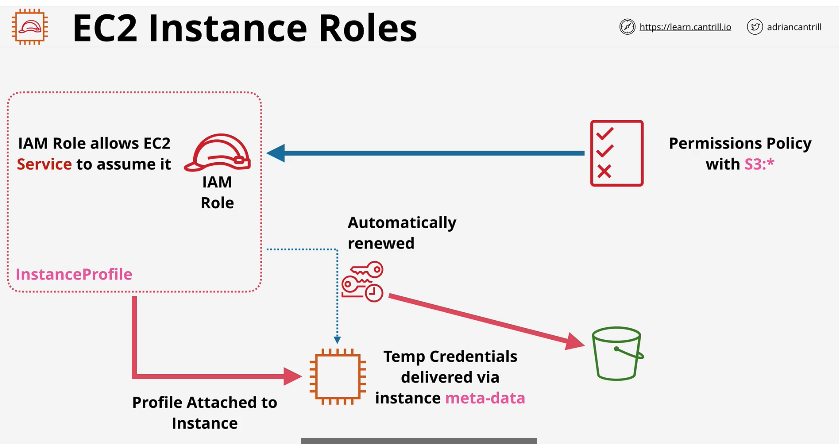
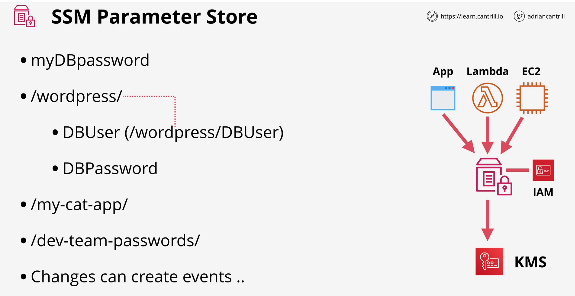
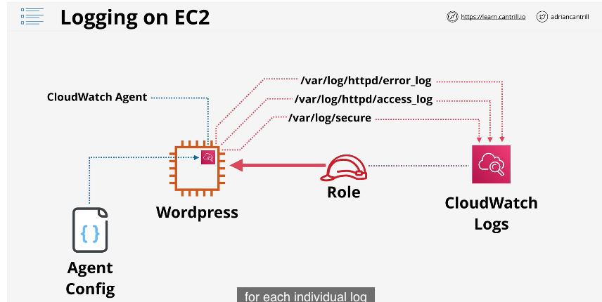
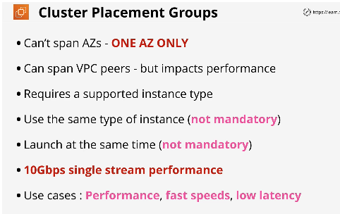
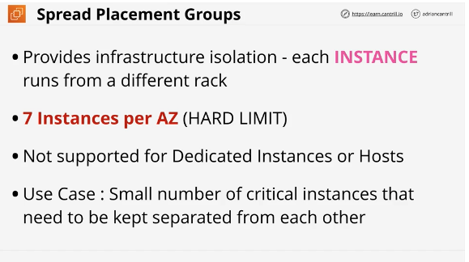
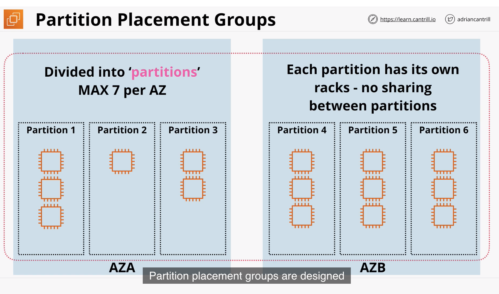
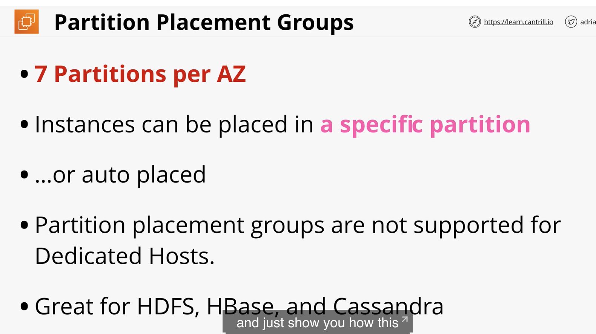
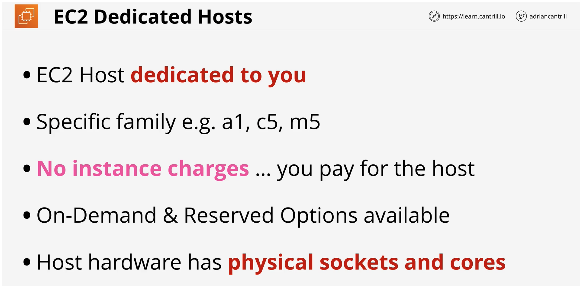
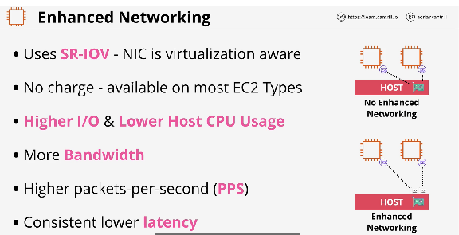
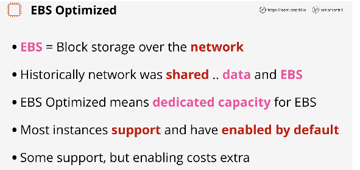

## Bootstrapping EC2 using User Data

#

- Bootstrapping is the process of configuring EC2 instance to perform automated install & configuration steps 'post launch' before instance is brought into service
- executed only once at launch time
- anything in User Data is executed by the instance OS
- if problem w/data instance can still be created, but you end up with bad config(see pic)
- User data is opaque to EC2 just a block of data

  - is not secure. don't use it for passwords or long term creds
  - user data is limited to 16kb
  - can be modified when instance stopped

    = 

- boot-time-to-service-time

  - time taken from launch time to service time
  - post launch time is time it takes to install apps on top of creating instance
  - can use AMI baking, front load the image
  - best way is to use AMI baking and bootstraping for optimal

  - 

## Enhanced Bootstrapping with CFN-INIT

#

- slightly beyond scope of test?
- is a way to pass complex bootstrap instructions to an instance
- allows you to set state for things like packages, users, groups, sources and files within resources inside a template
- works similar to console UI
- **cfn-init** helper script installed on EC2 OS
- checks for Desired State
- passed into instance via user data
- works with stack updates
- **CreationPolicy and Signals**: something that is added to logical resource inside template.
  - creates stack -> instance -> waits for signal from resource

## EC2 Instance Roles & Profile

#

- how applications running an EC2 instance can be given permission to access AWS resources on your behalf.
- role is attached to profile which is attached to instance
  -credentials are delivered inside metadata

  - iam/security-credentials/role-name
  - automatically rotated and always valid
  - should always roles

  - 

## SSM Parameter Store

#

- systems manager parameter store
  - storage for configuration & secrets
  - safely store license codes, database strings, full configs and passwords
- service of Systems Manager which allows storage and retrieval of parameters - strings, stringlist, secure strings
- supports encryption, integrates with KMS, versioning and can be secured using IAM
- integrates natively with many AWS services. can be accessed using CLI/APIs from anywhere
- 2 tiers. standard vs advanced

  - can create up to to 10,000 parameters with no charge
  - is a key/value pair
  - think .env values

  - 

## System and Application Logging on EC2

#

- **CloudWatch Agent** - adds internal instance metrics and logging collection and injection
  - cloudwatch is for storing and logging metrics
  - agent allows you to capture data inside of an ec2 instance
  - needs to have configurations and permissions to access inside of instance
- uses an agent config file

  - interacts with instance through iam role with permissions to cloudwatch logs
  - create log group for every log you want to capture

  - 

- can install and configure using cloudformation and parameter store

## EC2 Placement Groups - part 1

#

- placement groups allow you to influence placement. either physically close together or not

- three different types of placement groups in AWS

  1. Cluster placement groups (performance)
  2. Spread placement groups (resilience)
  3. Partition placement groups (topology awareness)

1. cluster: pack instances close together.

- highest level of perform inside EC2
- have to belong to a single Availability Zone
- run in same space. Same rack sometimes same host
- low latency max throughput
- little or no resilience. because they are physically close to each other
  if one fails all go down
- used to achieve 10gbps single stream perform
- exam notes:

  - 

2. Spread:

- max amount of availability and resilience
- can span multiple Availability Zones
  - instances placed on diff racks
  - limit - 7 instances per AZ
- provides infrastructure isolation

  - each instance runs in a diff rack
  - hard limit: 7 instances per AZ

  - 

## EC2 Placement Groups - part 2

#

- Benefits and limitations of the three placement groups
  - continuation of last video

3. Partition placement groups

- Similar to spread but allow for more than 7 instances per AZ
- might need more than 7 for fault tolerance
- you have control over what partition your instance goes to
- 7 partitions max
- instances can be placed in specific partition or
- auto placed

  - 
  - 

## Dedicated Hosts

#

- are EC2 hosts which support a certain type of instance which are dedicated to your account
- you pay an ondemand or reserved price for hosts
- usually used for apps which use physical core/socket licensing
- comes in specific types/families

  - most require to set in advance

- only need to know it exists for the exam. not covered in detail
  - 

## Enhanced Networking & EBS Optimized

#

- Enhanced networking is the AWS implementation of SR-IOV.

  - standard allowing physical host network card to present many logical devices utilized by instances
  - EBS optimization on instances means dedicated bandwidth for storage networking - separate from data networking

  - 
  - 
