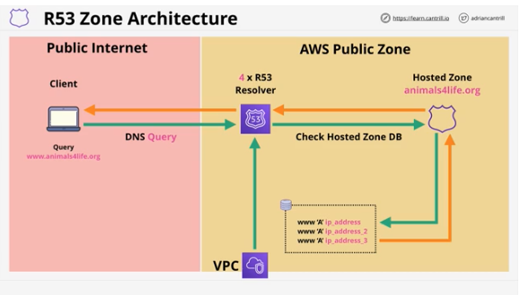
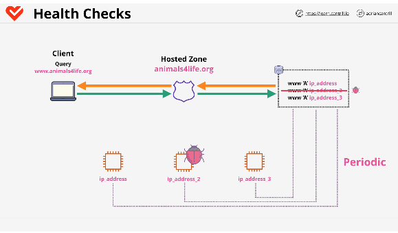
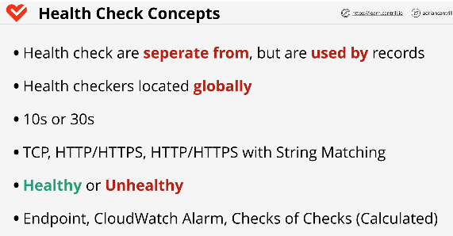
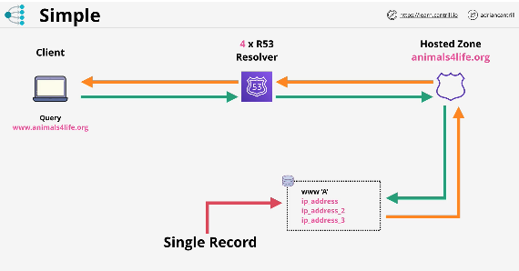
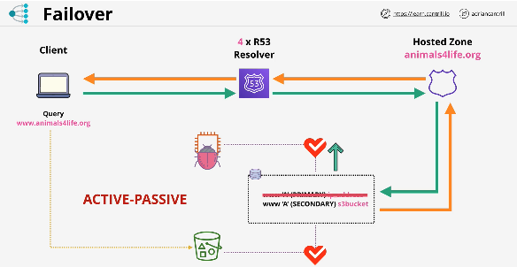
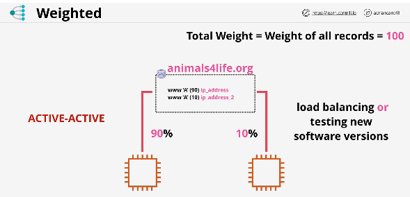
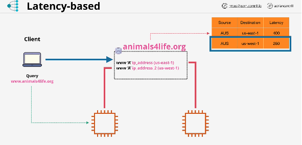
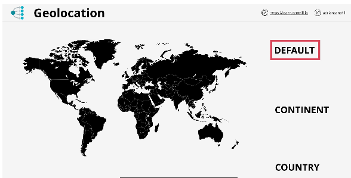
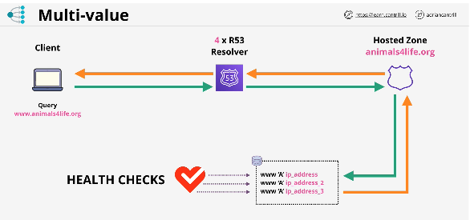

## Route 53 Public Hosted Zones

#

- Public hosted zones are hosted on public DNS nameservers managed by R53
- globally resilient(multiple dns servers)
- local caching is based on the TTL value in the record
- there are commands to clear the cache - see lesson

  - 
  - 

## Route 53 Health Checks

#

- used to evaluate the health of endpoints
- allows R53 to make more complex DNS routing decisions based on health states
- separate from records, but used by records
- health checkers located globally
- by default checks every 30s. can be increased to 10s for a cost
- types of checks:
  - TCP
  - HTTP/HTTPS
  - HTTP/HTTPS w/string matching
- 2 statuses : Healthy or unhealthy

  - 
  - 

## R53 Routing Policies

#

- controls how r53 responds to queries.

- routing policies available within R53:

  - Simple: the client gets back all the values. it picks one to use. no health checks

    - 

  - Failover: create 2 records. 1 primary 1 secondary. Uses health checks.uses active/
    passive failover routing

    - 

  - Weighted:very powerful. create multiple records w/same name. you assign them a weight.

    - 

  - Latency-based: create multiple records in multiple regions. source based routing

    - 

  - geolocation: query based on clients location.

    - 

  - Multi-value: similar to simple, you can have mult records w/same name with health checks

    - 
