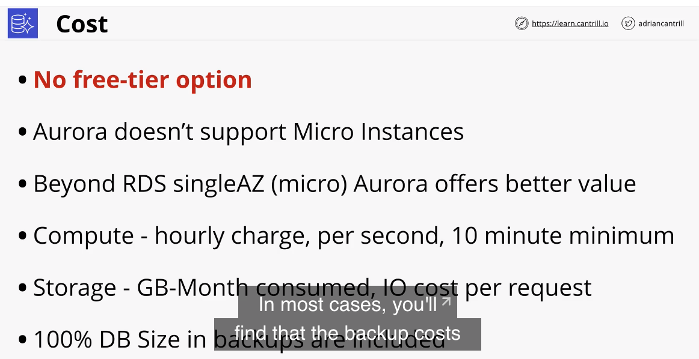
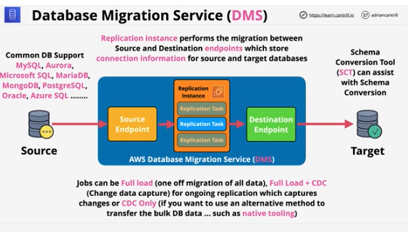

## Database Refresher - part 1

#

- DBs store and manage data
- there are diff types of systems
- relational (SQL) vs non-relational(NoSQL)

- relational dbs: (RDBMS)
  - structured. uses Schema
  - relationship between tables
- NoSQl:

  - not one single thing. everything that isnt RDBMS
  - much more relaxed
  - relationships are handled diff

- relational ex
  - 

## Database Refresher - part 2

#

- types of NoSQL dbs:
  1. key value - what I think it is. Scalable. used for in memory caching
  2. wide column store - variation of key/value. ex: dynamoDB
  - 
  3. document - store/query data as documents. JSON or XML. order db, collections, deep attributes
  - 
  4. column databases - diff than row dbs(sql). solve limitations of row dbs. row dbs - (OLTPS). column dbs store data in columns. good for reporting. aws ex is Redshift
  - 
  5. graphs - think graphQL. uses nodes and edges. relationships are also stored in db. makes them fast
  - 

## Databases on EC2

#

- pros and cons of running DBMS systems directly on EC2

  - one approach is to have everything in one ec2(monolithic?)
  - another is to have architecture split amongst multiple AZs

    - cost considerations, connection considerations

      

  - why you might run a db on ec2:

    - access to db instance OS
    - advanced db option tuning
    - using a DB aws doesnt support

      

  - why you shouldnt:

    - admin overhead
    - backups and disaster recovery mgmt
    - EC2 runs on a single AZ. if that zone fails, db could fail
    - features. AWS db products have amazing features
    - EC2 is on/off - no serverless or easy scaling
    - replication
    - performance

      

    - next 2 lessons dedicated to demos. Migrating the wordpress db monolithic to a dedicated EC2 db

## Relational Database Services (RDS) Architecture

#

- lesson covers high level architecture of the product and details what engines are supported, access methods, and other key concepts
- described as database-as-a-service(DBaaS)
- provides managed database instance (can hold 1+ databases)
  - think of it acting as a ec2 db server
- multiple engines:
  1. mysql
  2. mariadb
     3.postgres
     4.oracle
  3. MS sqlserver
- supports Amazon Aurora - will be it's own lesson in the future

  - 

- RDS instance
  - access it using a CNAME
  - can use existing tooling to access db
  - comes in diff sizes similar to ec2 instances
  - can be single AZ or multi AZ
  - you provision instance
    - comes w/block storage in same AZ
    - can fail because all in one AZ
- billing
  - billed for instance
  - also billed for storage
- security handled via security group

  - 

- next two lessons are demos
  1. migrating a mariadb into RDS part 1
  2. migrating a mariadb into RDS part 2

## RDS High-Availability (Multi AZ)

#

- feature that provisions a standby replica which is kept in sync Synchronously with the primary instance

  - cannot be used for performance scaling..only availability
  - backups, software updates, and restarts can take advantage of MultiAZ to reduce user disruption

- when it's enabled, secondary hardware is allocated inside a diff AZ
  - known as standby replica
- you only access RDS using the CNAME. it normally points to the primary instance
- uses synchronous replication
  - as soon as data is written to primary RDS drive, it is sent to secondary drive and written
  - very little if any lag
- if primary fails, database automatically points to secondary CNAME

  - happens quickly
  - is Highly Available but not fault tolerant

  - 

exam power ups

1. multi AZ is not free tier. costs extra
2. standby replica cannot be accessed directly. no performance improvement, it's a failover improvement
3. failover takes 60 - 120 seconds
4. same region only other AZs in the same VPC
5. backups are taken from the Standby
6. az outages, primary failure, instance type change, software patching

## RDS Automatic Backup, RDS Snapshots and Restore

#

- RDS is capable of performing manual snapshots and autobackups

  - manual snapshots are perfomed manually and live past the termination of the RDS instance
  - Automatic backups can be taken of an RDS instance with a 0(disabled) to 35 day retention
    - Automatic backups also use S3 for storing transaction logs every 5 minutes - allowing for point in time recovery
  - snapshots can be restored, but create a new RDS instance

- important topic for exam and real world usage
- ** RTO and RPO ** two important objectives

1. RTO - recovery time objective

- time between failure and full restore of service

2. RPO - recovery point objective

- time between the last bkup and the failure
- represents max amt of data lost possible
- lower the rpo, higher the cost

  - 

- rds backups

  - automatic bkups vs manual bkups
  - manual bkups live forever
  - automatic have a retention rate of 0 - 35
  - can use transaction logs for 5 minute level of granularity

    

- exam power ups

  1. restores create a new RDS instance - new address
  2. restoring a manual snapshot restores single point in time

  - increases rpo

  3. auto bkups are diff because of transaction logs
  4. restores arent fast think about rto

  - 

## RDS Read-Replicas

#

- read replicas can be added to an RDS instance - 5 direct per primary instance

  - can be in the same region or cross region replicas
  - provide read performance scaling for the instance, but also offer low rto recovery for any instance failure issues
  - don't help w/data corruption as the corruption will be replicated to the RR

- RR provide two main benefits - performance and availability
  - read only replicas of an RDS instance
  - can use for read operations
  - own db endpt address
- kept in sync using Asynchronous replication
- data is written fully to the primary instance first, then written to secondary replica instance
  - in theory could lead to lag, depends on connection
- can be created in same region or diff region

  - if cross region , AWS handles config, it just works

  

- why do they matter?

  - read performance improvements

    - 5x direct read replicas per db instance
    - each provide additional instance of read performance
    - can have read replicas of read replicas, but lag can start to be a problem
    - global perform improvements

    - 

  - availability improvements

    - snapshots and bkups improve RPO
    - rtos are still a problem
    - read replicas offer near zero RPO
    - read replicas can be promoted quickly to primary - low RTO - only works for failures
    - failure only. watch for data corruption. corruption gets replicated as well :(
    - read only until promoted. not reversable
    - global availability improvements - global resilience

    - 

  - next 2 lessons are Demos:
    - using a snapshot and restore to recover data from corruption part 1
    - using a snapshot and restore to recover data from corruption part 2

## RDS Data Security(PRO lesson - topic features in SAA-CO2)

#

- lesson covers RDS encryption at rest and RDS IAM authentication
- new lesson just added based on feedback on what's on the exam

- security handles data while in transit

  - can be mandatory ona per user basis
  - RDS supports EBS volume encryption - KMS
  - handled by the host/ebs
  - can use AWS or customer managed CMK data keys
  - storage, logs, and replicas are encrypted
  - encryption cannot be removed

  - 

- encryption at rest is handled diff ways depending on db engine used

- Microsoft SQL and RDS Oracle support TDE

  - encryption is handled by the db engine
  - RDS Oracle supports CloudHSM
    - keys controlled by user, not AWS involvement
  - 

- rds encryption architecture:

  - 

- RDS and IAM authentication

  - normally you create a user when provisioning an RDS instance
  - can use IAM if you want
  - only for authentication
  - authorization is handled by the db instance
  - users IAM and policy to issue a token w/15 minute validity

  - 

## Aurora Architecture

#

- Aurora is a AWS designed database engine officially part of RDS

- Aurora implements a number of radical design changes which offer significant performance and feature improvements over other RDS database engines.

- This lesson steps through the changes introduced with the Aurora architecture.

- architecture is diff from RDS
  - uses a cluster
  - a single primary instance and 0 or more replicas
  - replicas provide both benefits of read/write vs RDS
  - no local storage uses cluster volume
  - replication happens on the storage level
  - storage system is much more resilient. uses fault tolerance to avoid data loss. no need for restores
  - SSD based storage
  - billing is based on what you consume
- downsides
  - no free tier
  - costs - see chart
- restore

  - can enable backtrack. think "time machine"

  slides:

  - 
  - 
  - 
  - 
  - 
  - 

- next lesson is a demo
  - migrating Wordpress onto Aurora

## Aurora Serverless

#

- lesson compares Aurora serverless vs Aurora provisioned
- is akin to Fargate to ECS
- removes admin overhead of managing individual db instances

- creates scalable Aurora ACUs - Aurora Capacity Units

  - aurora serverless cluster has a min/max CPU
  - Cluster adjusted based on load
  - billing based on per second consumption
  - same resilience as Aurora Provisioned 6 copies across AZ

- Architecture similarities and diffs vs Provisioned

  - same cluster architectrue
  - uses ACUs instead of servers
  - ACUs come from a pool managed by AWS
  - pools are stateless
  - no local storage
  - uses a prox fleet, application interacts w/proxy fleet and it manages the ACUs

- serverless use cases

  - infrequently used apps - flex billing
  - new apps - unsure of usage
  - variable workloads
  - unpredictable workloads
  - development and test databases - can pause itself

- slides

  - 
  - 
  - 

- next lesson is a demo
  - migrating to Aurora Serverless

## Aurora Global Database

#

- only need awareness of this for exam

- feature of Aurora Provisioned clusters

  - allow data to be replicated globally providing significant RPO and RTO improvements for BC and DR planning
  - can provide performance improvements for customers - data being closer to them, in a read-only form
  - 1 second replication time between all AWS region

- used cases
  - Cross Region disaster recovery and business continuity
  - low RPO and RTO
  - global read scaling - low latency performance improvements
  - 1s or less replication between regions. 1 way replication
  - no impact on DB performance
  - secondary regions can have 16 replicas
  - can be promoted to R/W in event of disaster
  - currently max of 5 secondary regions
- ## slides:
  - 
  - 

## Multi-master writes

#

- mode of Aurora Provisioned Clusters that allows multiple instances to perform R/W at same time.

  - instead of only one primary instance have capability

- default mode is single-master. one primary that r/w replicas only r
- multiple endpoints for each instance - one for r/w endpoint, rest for r for load-bal
- failover takes time - replicas promoted to r/w

- in multi-master mode, all instances are r/w

  - no concept of endpoints
  - application can connect to any node in cluster
  - replication between nodes in cluster

- benefits:

  - single-master takes time in a failover. not fault tolerant. causes disruption
  - multi-master no disruption
  - better, faster, availability

- slides:
  - 
  - 
  - 
  - 

## Database Migration Service (DMS)

#

-featured more and more in the exam

- managed service which allows for 0 data loss, low or 0 downtime migrations between 2 database endpoints
- service is capable of moving databases in or out of AWS

- runs using a replication instance

  - runs a task needs to define source and destination endoints
  - source and target databases
  - one endpoint must be on AWS

- supports common db engines. see slide
- inside of DMS you define replication tasks
- 3 job types
  - full load - one migration of all data
  - full load + CDC - change data capture for ongoing replication which captures changes
  - CDC - if you want to use alt method to xfer the bulk DB data - vendor provided tool
- can u se schema conversion tool(SCT) can assist with schema conversion

- slides
  - 
  - 
