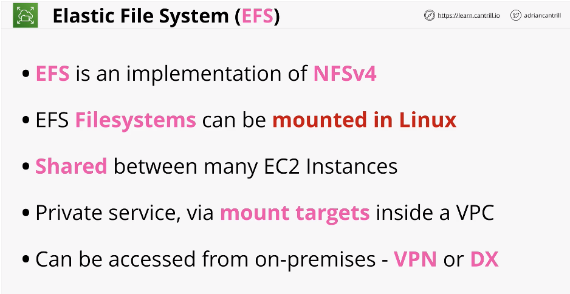

## EFS Architecture

#

- Summary:

  - AWS managed implementation of NFS which allows for the creation of shared 'filesystems' which can be mounted with multi EC2 instances
  - moves EC2 instances to a point of being stateless
  - create EFS filesystems that can be mounted in Linux
  - data can be shared between many EC2 instances
  - EFS is private service via mount targets inside VPC
  - can be accessed from on-prem - VPN or DX
  - 

- architecture:

  - EFS lives inside a VPC
  - uses POSIX permissions - link in lesson
    - link https://en.wikipedia.org/wiki/File_system_permissions
  - accessible via mount targets inside AZs.
    - for HA use multiple mount targets, one inside each AZ
  - can connect to on-prem network via direct connect. see slide
  - 

- exam notes:
  - linux only instances
  - 2 perform modes: general purpose and max i/o
    - GP is default
  - 2 throughput modes: bursting and provisioned
  - 2 storage classes: infrequent access and standard
  - can use lifecycle policies
  - 
- Next 3 lessons are demos, then topic is completed, shorter topic

## Demos

#

- There are 3 demos total in this lesson

  - Implementing EFS part 1
  - Implementing EFS part 2
  - Scaling Wordpress with EFS
