## 1. Load Balancing Fundamentals

#

- Summary:

  - how load balancers work and what they actually do
  - how they differ from DNS HA features such as multivalue request routing

- fundamentals:
  - life w/o load balancers
    - all traffic goes to one server - bad
    - could have multiple servers and use DNS multi value routing to route traffic
      - helps but doesnt scale well
    - DNS routing is good globally but locally
    - locally use load balancing
    - 
  - life w/load balancer
    - listens for a port
    - user connects to load balancer not server
    - client has no awareness of load balancer. thinks it's talking to server
    - lb runs health checks
    - 
- exam notes:
  - clients connect to load balancer
    - specially to the listener
  - LB connects to targets(aka servers)
  - 2 connections. 1 to listener 1 to backend
  - client abstracted from individual servers
  - used for HA, FT, and scaling
    - 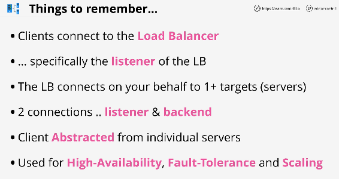

## 2. Application Load Balancing (ALB)

#

- Summary:

  - lesson steps through architecture of ALB
  - talks about Target Groups, connection architecture, and how ALB achieves HA and Scaling

- concepts:

  - ALB is a layer 7 LB - understands HTTP/S
  - scalable and highly available
  - internet facing or internal
    - depends if nodes have public IP or not
  - sits inbetween client and server
    - listens on the outside - sends to Targets(aka groups)
  - billing:
    - bills on hourly rate and LCU rate(capacity)
    - 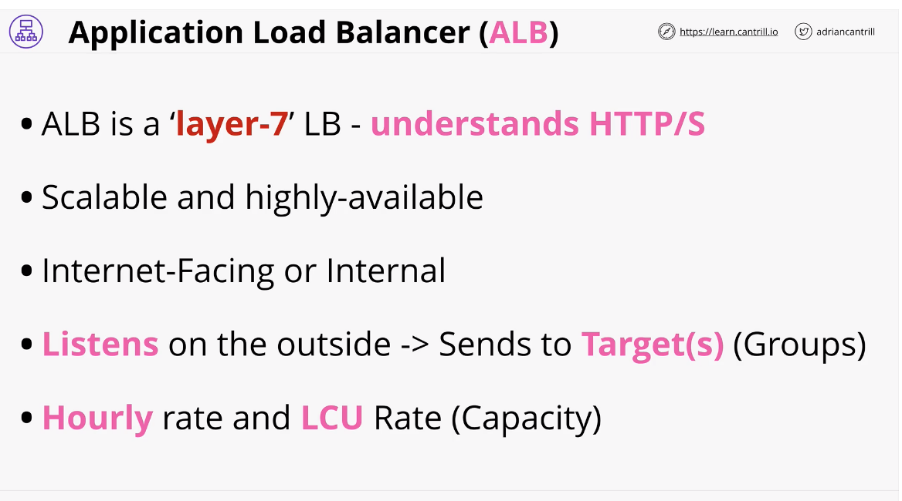

- architecture:

  - each AZ in a VPC gets a lb node
  - client sends request to lb
  - uses cross zone load balancing to distribute load evenly among all AZs
    - 
  - performs health checks
    - 
  - target and groups:
    - where the load is going from the lb is a target
      - can be multiple things, ec2 instances, lambdas, etc
      - can be grouped together
    - 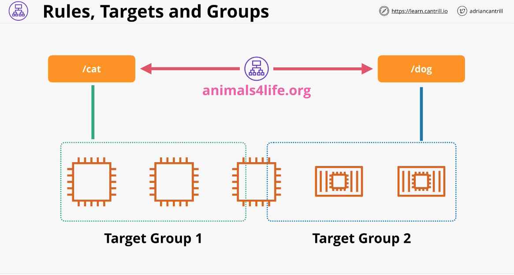

- exam power ups:
  - targets are ec instances, lambda functions, containers
  - rules are path based or host based
  - supports ec2, ecs, eks, lambda, http/s/2,
  - alb can use SNI for multi SSL certs
  - albs are recommended vs clb(legacy classic lbs)
    - 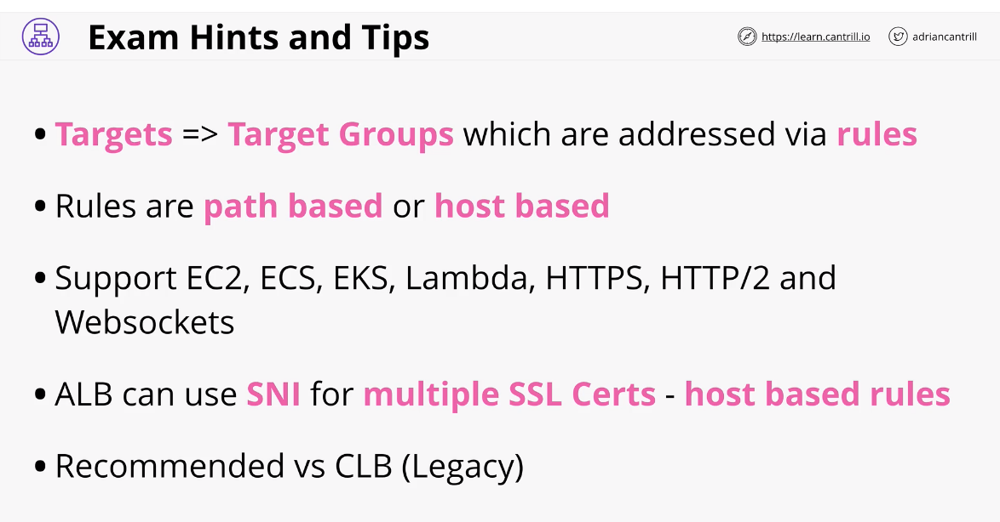

## 3. Launch Configuration and Templates

#

- summary:

  - launch configurations and templates provide the **what** to auto scaling groups
  - define what gets provisioned
    - the AMI
    - instance type
    - networking & security
    - key pair to use
    - user data to interject
    - IAM role to attach

- concepts:
  - allow to define config of ec2 instance in advance
  - AMI, instance type, storage, key pair
  - networking, sec group
  - user data and IAM role
  - both are not editable. defined once LT has versions
  - LT has newer features - see slide
  - 
- architecture:
  - launch configs are not editable
  - templates are, are recommended by AWS are newer -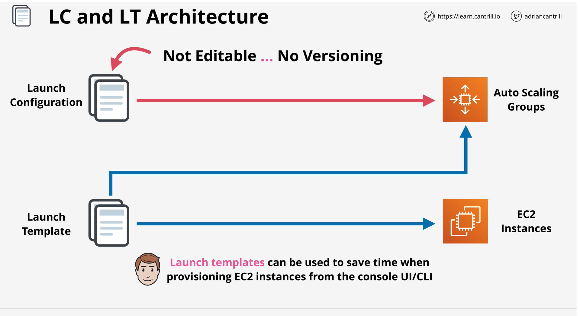

## 4. Auto-Scaling Groups

#

- summary:

  - is how Scaling and self-healing can be implemented within AWS using EC2
  - ASGs use LT and LC to control **WHAT** gets launched, and provide various types of scaling policy to scale out and in based on metrics

- concepts:

  - do one thing: provide auto scaling and self healing for EC2
  - make use of configurations defined in LT or LC
  - 3 super important values
    - min size
    - desired capacity
    - max size
  - provisions or terminates instances to keep at desired level (between min/max)
  - can be performed manually or uses Scaling Policies based on metrics
  - 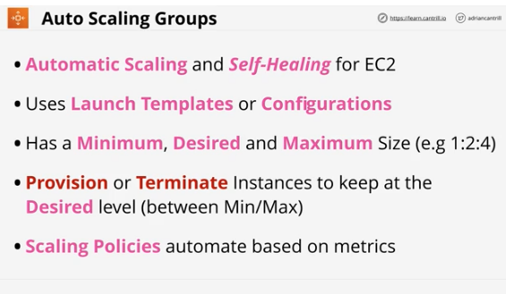

- architecture:

  - ASG run inside a VPC across 1/more subnets
  - config provided by LT or LC
  - based on desired capacity and min/max.
  - can used scaling polices or increase manually
  - ASGs are linked to VPC where instances are launched
  - attempts to keep each subnet even
    - 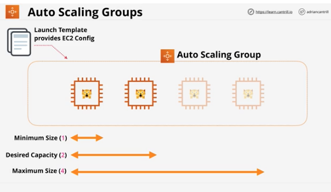
    - 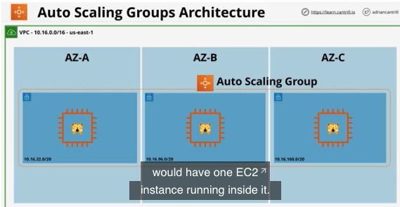

- scaling policies

  - essentially rules you define to adjust values in ASG
  - 3 ways to scale:
    - 1. manually
    - 2. scheduled scaling - see slide
    - 3. dynamic scaling - simple(action based on metric),stepped(more extreme way), target tracking (define ideal amt)
  - cooldown periods - controls how long to wait before performing another scaling action
    - 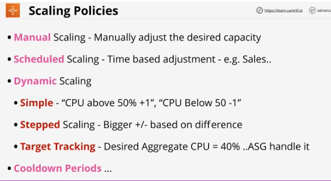

- self healing
  - ASG checks health, if an instance is down, it replaces it automatically
- integration w/load balancers
  - example:
    - user connects to blog via lb. points to target group. use an ASG inside target group
    - see slide. example of elasticity
    - can use ASG health checks for better results
    - 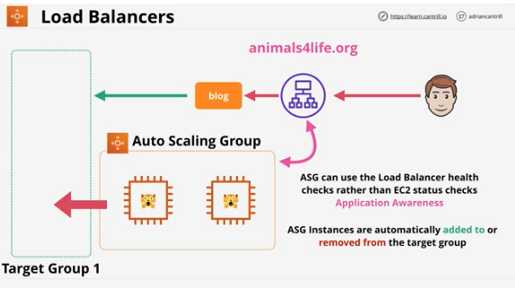
- final points:

  - ASGs are free
  - only the resources created are billed
  - use cool downs to avoid rapid scaling and high billing
  - think about more, smaller instances - granularity
  - use with ALBs for elasticity - abstraction
  - ASG defines when and where LT/LC define what
    - 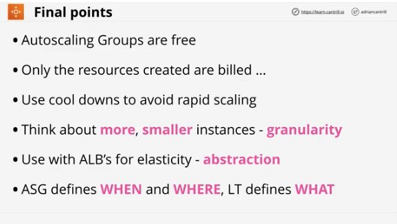

- next four lessons are demos:
  - Elastic Cat Blog - Architecture
  - Elastic Cat Blog - part 1 - launch template
  - Elastic Cat Blog - part 2 - Autoscaling group
  - Elastic Cat Blog - part 3 - Load Balancer
  - 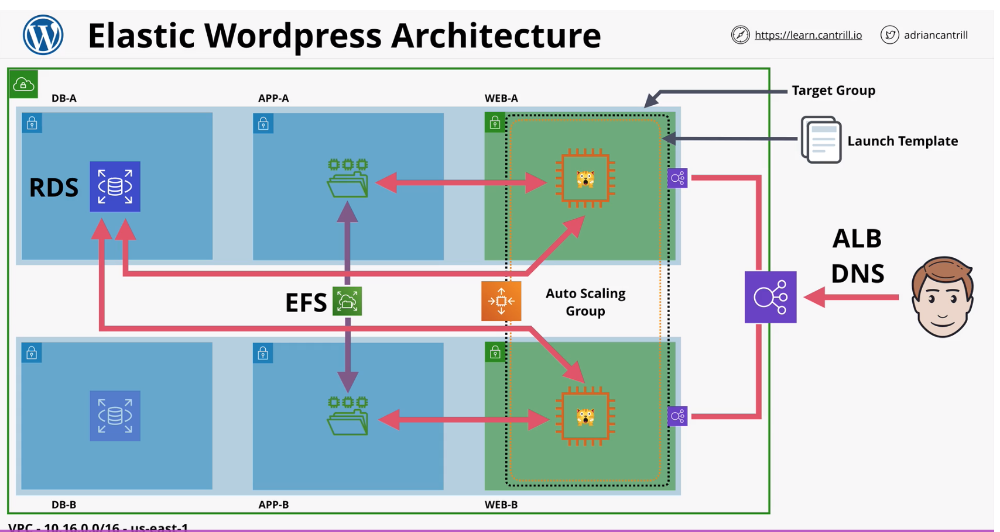

## 5. Network Load Balancing (NLB)

#

- summary:
  - lesson steps through differences between ALB and NLB
    - focusing on situations where you would pick NLB vs ALB
    - no implementation knowledge for exam
    - brief lesson
- concepts:

  - are layer 4 load balancers
    - understand up to TCP and UDP
  - can't understand HTTP/S but is faster for application load balancers
  - can load balance network connection part
  - highest performance of load balancing family
    - for exam, if performance is priority
  - 1 interface w/static ip per AZ can use Elastic IPs(whitelisting)
  - can do SSL pass through
  - can load balance non HTTP/S applications - doesnt care about anything above TCP/UDP

- slide:
  - 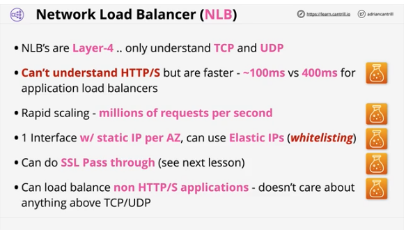

## 6. SSL Offload & Session Stickiness

#

- summary:

  - 3 diff ways that ELBs handle SSL
    - SSL bridging
    - SSL Pass Through
    - SSL Offloading
  - lesson also covers what session stickiness means, and why it matters to SAs

- concepts:

  - need to know theory and architecture for exam
  - each of the 3 ways come w/pros and cons

    - 1. bridging:
      - default of ELB
      - listener uses HTTPS, connection is terminated on the ELB, needs a certificate for that domain
      - means AWS has some level of access to that cert
    - ELB then makes connections to the backend
    - HTTPS is is just HTTP in a secure wrapper
    - ELB then unecrypts data, interprets it, re-encrpyts it, sends to EC2 instances.
    - EC2 instances also need the SSL cert
    - 2. Pass-Through
      - client connects, but the ELB just passes connection along to the backend instances
      - ELB doesnt need cert, but the instances do
      - is a NLB, is configured to listen for TCP
      - pros: aws doesnt see the cert cons: no load balancing based on application http
    - 3. offload
      - ELB needs certificate, but the ELB is configured to connect to backend using http. EC2 instances don't need cert
    - 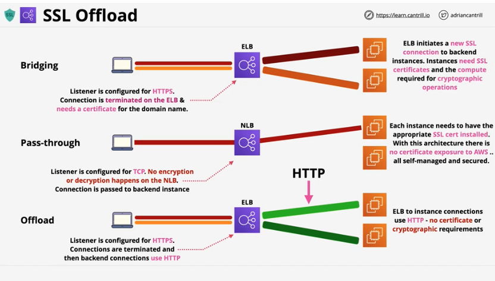

  - stickiness:
    - with no stickiness, ELB distributes connections evenly among all instances
    - problem is when application has state, like shopping carts
    - enable stickiness on a target group
      - elb generates a cookie called awsalb
      - you determine life of cookie
      - sessions are sent to the same instance because of cookie
      - happens until either server failure or cookie expires
      - user receives new cookie and new connection to an instance
      - session stickiness is allowed to use a load balancer if the state of the user session is stored on an individual server
      - con: can cause uneven loading
      - applications should be allowed stateless servers. sessions should be hold elsewhere like on dynamodb -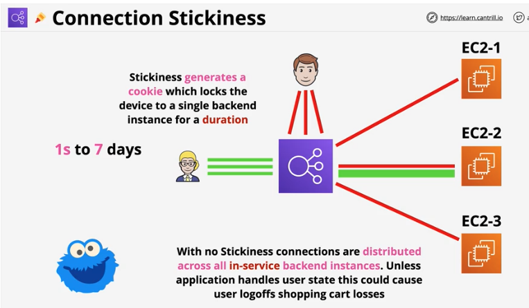
