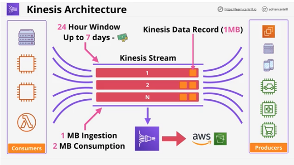

## 1. Architecture Evolution - Part 1 - Monolithic and Tiered

#

### summary

- 2 part lesson, first part covers how applications can be evolved from monolithic to tiered architecture

### concepts

- monolithic architecture
  - one box handles everything. see cattube example
  - cons: one failure to part affects everything. fail together. also scale together since on same server, and bill together
  - 
- tiered architecture
  - things are still connected together, but can scale independently
  - can use internal load balancers to manage each tier's load
  - allows for horizontal scaling and HA
  - cons: each tier is still dependent on each other so can't scale to zero and could still fail
  - 

## 2. Architecture Evolution - Part 2 - Queue Based, Microservice & Event Driven

#

### summary

- part 2 looks at the evolution of architecture - queue based design, microservices, event driven architecture

### concepts

- queue

  - similar to CS. FIFO
  - uses async communications, doesn't depend on another tier. decoupled. think cattube s3 bucket from slide
  - 

- microservice and event driven architecture
  - do individual things well
  - a microservice is just a tiny self sufficient application
  - producers are triggered by events, consumers take from producers
  - events are generated when something happens
  - event routers handle events between producers/consumers via event bus
  - event driven architectures only consume resources when required
  - 

### architecture

- slides
  - 
  - 

## 3. AWS Lambda

#

### summary

- AWS Lambda is a FaaS(function as a service) provides ability to execute small lambda functions and pay for only the execution duration
- can be invoked manually scheduled in an event-driven way

### concepts

- is a FaaS product
- can be event driven invocation(execution)
- is a piece of code in one language
- Lambda functions use a runtime(eg Python 3.6)
- runs inside of a runtime environment
- you are only billed for the duration the function runs for
- key component of serverless architecture
- 

### architecture

- when creating a Lambda function you create a container sortaof
- it's a piece of code that does something
- s/b super specialized
- various languages
- runs in a runtime environment
- you allocate memory/cpu more you allocate more expensive
- can be configured to use IAM role known as execution role
- can be invoked manually or event-driven
- when it's invoked, it's downloaded on to AWS hardware
- the environment it runs in is new and clean (stateless). do not store anything in it
- are public services, have access to internet
- can be configured to run inside a VPC, but will only have internet access if the VPC is configured for internet access
- since Lambda functions are stateless, they get data from internet or AWS resources. needs to have appropriate permissions from execution role to input/output to those resources
- Lambda functions have a 15 minute execution limit
- cheaper than running EC2, especially for things which don't need to run all the time.
- 

### Key considerations

- currently 15 minute execution limit
- new runtime env every execution no data persistence
- execution roles provides permissions
- load data to/from other services (eg S3, DynamoDB)
- free tier
  - 1M free requests and 400,000 GB-seconds of compute time per month
- 

## 4. CloudWatchEvents and EventBridge

#

### summary

- are services that monitor and have visibility over events generated by supported AWS services within an account
- can monitor the default account event bus and pattern match events flowing through and deliver these events to multiple targets
- are also the source of scheduled events which can perform certain actions at certain times of day using CRON time expression format
- both services are how event-driven architectures can be implemented within AWS

### concepts

- Eventbridge is replacing Cloudwatch events. is basically cloudwatch events v2
- logic is "If X happens, or at Y time, do Z"
- both have a default event bus for the account
  - in cloudwatch events, only 1 bus and it's implied
  - in eventbridge, can have multiple buses
- create rules that match incoming events or schedules
- routes events to 1/more targets (eg Lambda)
- 

### architecture

- at the heart is event bus - stream of events generated by supported AWS services
- eventbridge monitors events and you create rules
  - 2 types of rules, pattern matching and scheduled
- delivers events to targets
- events themselves are JSON objects
- 

### next lessons

- next 2 lessons are demos
  - Automated EC2 start/stop and protect using Lambda and events part 1
    - manual invocation
  - Automated EC2 start/stop and protect using Lambda and events part 2
    - event-driven invocation

## 5. API Gateway

#

### summary

- is a managed service from AWS which allows the creation of endpoints, resources, & methods
- API Gateway intergrates w/other AWS services - and can even access some without the need for dedicated compute
- serves as a core component of many serverless architectures using Lambda as even-driven and on-demanding backing for methods
- can also connnect legacy monolithic applications and act as a stable API endpoint during an evolution from a monolith to microservices and potentially through to serverless
- APIs are basically code on a server which provide interfaces to a particular service
- most cases perform authentication and authorization
- 

### concepts

- API Gateway is a managed service provides managed API endpoints you can present to your customers so they can use it
- create publish monitor secure APIs as a service
- billed on num of API calls, Data Transfers, and features such as caching
- can be used directly for serverless architecture
- can be used to xfer legacy systems that host their own APIs
- 

### architecture

- is HA and scalable. can use "inbetween" legacy app and monolithic architecture. see slide
- can be part of evolution to microservices architecture, while keeping same endpoints
- or could move to serverless architecture. see slide
- has direct access to some AWS services (think dynamoDB) see slide
- 

## 6. Serverless Architecture

#

### summary

- Serverless architecture is an evolution/combination of other popular architectures such as event driven and microservices
- uses 3rd party services where possible anf FAAS products for any on-demand computing needs
- using serverless architecture means little to no base costs for an environment. any costs incurred during operations scale in a way with matches the incoming load
- Serverless is starting to feature more on the exam - critical to understand

### concepts

- Serverless isn't one thing - more of software arch than hardware arch
- aim to manage few, if any servers - low overhead
- borrows concepts from microarchitectrue
- applications are a collection of small & specialized functions
- applications run in a stateless and ephemeral environments - duration billing
- everything is event-driven. consumption only when being used
- FaaS is used where possible for compute functionality. Function as a Service
- should use managed services when possible
- 

### architecture

- no servers or EC2 instances
- ex: user connects to website hosted on S3
  - app uses 3rd part for auth
  - app uses AWS Cognito to issue temp AWS creds
  - user uploads file to original bucket
  - bucket generates an event to Lambda function to process file
  - uses manages service to process job. Elastic transoder example in slide
  - xfers files to a managed db - DynamoDB
  - lastly, users clicks on link, targets another Lambda function. loads files from dynamodb and renders files to user
  - 

## 7. Simple Notification Service

#

### summary

- SNS is a pub sub style notification system used in AWS products and services
- can be essential part of serverless, event driven and traditional application architectures
- publishers send messages to topics
- subscribers receive messages sent to topics
- SNS supports a wide variety of subscriber types including other AWS services such as Lambda and SQS

### concepts

- public AWS service - network connectivity with public endpoint
- coordinates the sending and delivery of messages
- messages are up to 256kb payloads
- not designed for large binary files
- SNS topics base entity of SNS - permissons and configurations
- A publisher sends messages to a Topic
- Topics have subscribers which receives messages
  - topics could be http(s), email, SQS, mobile push, SMS messages, Lambda
- used across multiple AWS services
- 

### architecture

- public space AWS service
- can be accessed from internet assuming permissions
- runs from public zone, topics created inside
- services publish messages into a topic
- topic sends to subscribers
- can setup filter
- use Fanout to send a topic to mulitple queues using SQA queues?
  \_ 
-

### Functionality

- offers delivery status
  - ex: HTTP, Lambda, SQS
- delivery retries
- HA and Scalable (regional resilient)
- server side encryption (SSE)
- cross account via Topic Policy
- 

## 8. Step Functions

#

### summary

- step functions is a product which lets you build long running serverless workflow based applications within AWS which integrate with many AWS services

### concepts

- addresses limitations of Lambda
  - Lambda is a FaaS
  - specialized functions do one thing well
  - duration limit of 15 minutes
  - could in theory chain Lambda functions
  - gets messy at scale
  - runtime environments are stateless
- State Machines
  - step functions create state machines
  - serverless workflows start -> states -> end
  - states are things which occur
  - maximum duration is 1 year
  - two workflows - standard workflow and express workflow
    - for the exam, remember standard is the default, 1 year duration
    - express for things that are transactional
  - started via API Gateway, IOT rules, EventBridge, Lambda
  - generally used for BE processing
  - can use templates - Amazon States Language (ASL) Json template
  - uses IAM roles for permissions
  - 
- States
  - states are things inside workflow - things which occur
    - types of state:
      - succeed/fail
      - wait
      - choice
      - parallel
      - map
      - Task - unit of work performed by state machine. can be integrted w/diff services
        state machine controls flow through state machine, uses task states to coordinate actual work
      - 

### architecture

- ex: bob creates an app to cuddle whiskers. whiskers sends bob a reminder when he wants cuddles -> see diagram
- in summary: step functions create state machines. state machines are long running serverless workflows that have states. states are decision points or tasks that perform things
- 

### Demos

- next 5 lessons are demos:
- implementing a serverless application using Step Functions, Lambda, SNS, SES, API Gateway and S3 static web hosting.
- application will be serverless and event driven and use no base long running compute while inactive. Resources will only be consumed when the application is dealing with user created events

  1. Pet cuddle-o-tron serverless application part 1

  - configure SES - Simple Email Service
    - managed service that lets you send email

  2. part 2

  - add Lambda function to send email on behalf of the state machine
  - imported code from github repo and created Lambda function. replaced from email w/my email address

  3. part 3

  - implement the state machine itself and configure it's integration
  - state machine manages flow of application
    - three steps
      - create role state machine will use
      - create state machine
      - config

  4. part 4

  - implement and config the API, resource, method and it's supporting Lambda function
  - doing 2 things. creating the Lambda function and setting up the API
  - used Lambda to create function that handles logic for where to end email
  - used API Gateway to create an endpoint/api for our app to hit

  5. part 5

  - implement the static client application and perform some testing
  - client side is a static website hosted on S3 bucket
  - will edit client files to point to API created via Gateway

## 9. Simple Queue Service

#

### summary

- SQS is a manged message queue service in AWS which helps decouple application components
- allows asynchronous messaging or the implementation of worker pools

### concepts

- managed message queues. public. fully managed. standard or FIFO
- msgs size up to 256kb in size. you can link(S3) to larger data
- received msgs are hidden - visabilityTimeout
- after visabilityTimeout, msg either reappears or are explicitly deleted
- Dead-Letter queue used for problem msgs
- ASGs can scale and Lambda can invoke functions based on queue length
- 

### architecture

- 2 ASG groups - 2 pools
- one pool accepts vid, stores in S3 bucket. sends msg to Queue
- pool autoscales based on cpu usuage
- Queue sends msg to worker pool. worker pool transcodes video after retrieving vid from S3 bucket.
- it scales based on length of queue
- 
- 

### wrapup

- think of standard - at least one delivery, no guarantee of order(multi lane hwy)
- think of FIFO - exactly one delivery(single lane hwy)
- FIFO - performance limitations - see slide
- standard scale better
- billed on requests
- less efficient and less cost effective
- 2 ways to poll - short vs long
- should use long polling - uses less requests
- supports encryption at rest KMS and in transit
- can use identity policies or Queue policies
- 

## 10. Kinesis & Kinesis Firehouse

#

### summary

- kinesis data streams are a streaming service within AWS designed to ingest large quantities of data and allow access to that data for consumers
- ideal for dashboards and large scale real time analytics
- kinesis data firehose allows the long term persistent storage of kinesis data onto services like S3
- lesson evaluates the diff between SQS vs Kinesis and ids key factors in exam questions for picking one vs the other

### concepts

- is confused w/SQS
- kinesis is a scalable streaming service
- producers send data into a kinesis stream
  = can scale from low to ner infinite data rates
- public service and HA by design
- stream store a rolling 24hr window of data
- storage is included
- multiple consumers access data from that moving window
- 

### architecture

- producers - ex: s3 buckets, servers, etc
- consumers- ec2 instances, lambda functions, severs, etc
- in the middle is kinesis stream
- producers send data to stream, consumers pull from stream
- uses shards?
- window can be increased from 24hr to 7 days for addtl cost
- data stored via kinesis data records
- firehose connects to stream
- can connect data from stream to AWS service like S3
- 

### kinesis vs SQS

- SQS generally 1 production group, 1 consumption group
- worker pools, decoupling -> SQS
- ingesting data -> kinesis
- SQS - no persistance
- kinesis - huge scale ingestion of data
- designed for multiple consumers....rolling window
- data ingestion, monitoring, analytics, streaming
- 
