## 1. VPC Flow Logs

#

### summary

- VPC flow logs is a feature allowing the monitoring of traffic flow to and from interfaces within a VPC
- VPC flow logs can be added at a VPC, subnet, or interface level
- flow logs don't monitor packet contents -> that requires a packet sniffer
- flow logs can be stored on S3 or cloudwatch logs

### concepts

- essential diagnostic tool
- need to know functionality for exam
- only capture packet metadata. not packet contents
- source/dest ip address, etc anything you can observe from the outside
- can apply to 3 diff levels
- VPC, subnet, interface
- flow logs are not realtime
- can be config to use S3 or cloudwatch logs
- 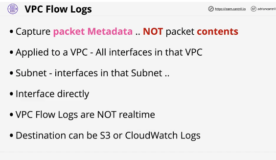
- inheritance down see arch slide

### flow logs

- collection of fields
- ex: bob is pinging ec2 instance inside his subnet
- flow log in slide
- source dest ip port number protocol number accepted/rejected
- dont log all traffic. some things are excluded
- 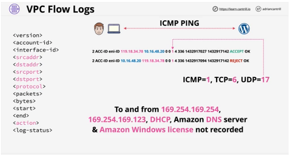

### architecture

- make sure you put the monitor in the correct spot. see slide
  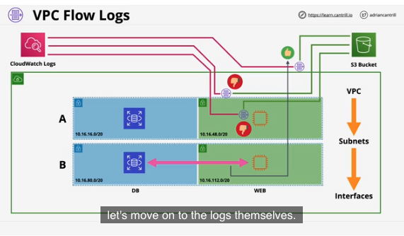

## 2. Egress-Only Internet Gateway

#

### summary

- allow outbound(and response) only access to the public AWS services and public internet for IPv6 enabled instances or other VPC based services

### concepts

- IG that only allows connections from inside to outside
- w/IPv4 addresses are private/public
- NAT allows private IPs to access public networks
- without allowing externally initiated connections(in)
- with IPv6 all IPs are public
- IG(IPv6) allows all IPs in and out
- NAT doesn't work with IPv6, that why we have egress-only IG
- 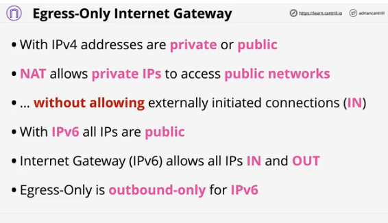

### architecture

- 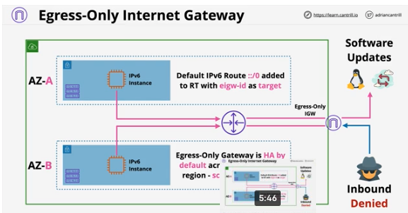

## 3. VPC Endpoints (Gateway)

#

### summary

- Gateway endpoints are a type of VPC endpoint which allows access to S3 and DynamoDB without using public addressing
- Gateway endpoints add 'prefix lists' to a route table, allowing the VPC router to direct traffic flow to the public services via the gateway endpoint

### concepts

- used in more complex arch
- provide private access to services - S3 and DynamoDB
- normally public ip addresses are required
- prefix list added to route table -> gateway endpoint
- GE are highly available (HA) across all AZs in a region by default
- endpoint policy is used to control what it can access
- regional...can't access cross-region service
- 2 main use cases
  - private vpc allow to access public resources - S3 or DynamoDB
  - private only S3 buckets. help prevent leaky buckets
- limitations: only accessible from inside that specific VPC
- 

### architecture

- current architecture w/o vpc endpts
- 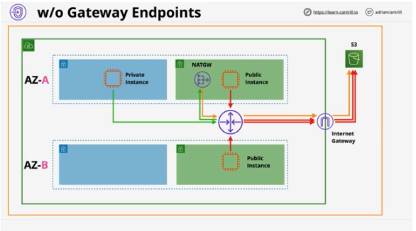
- arch w/gateway endpt
- 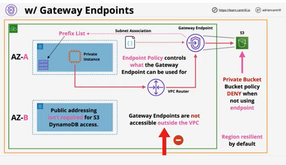

## 4. VPC Endpoints (Interface)

#

### summary

- interface endpoints are used to allow private IP addressing to access public AWS services
- S3 and DynamoDB are handled by gateway endpoints
- other supported services are handled by interface endpoints
- unlike gateway endpoints, interface endpoints are not HA by default - they are normal VPC network interfaces and should be placed 1 per AZ to ensure full HA

### concepts

- similar to gateway endpts but diff execution
- provide private access to AWS public services
- ...anything not S3 or DDB
- difference: interface endpts are not HA by default
  - added to specific subnets
  - for HA add one endpt to one subnet per AZ used in the VPC
- network access controlled via Security Group
- Endpoint policies - restrict what can be done w/endpoint
- TCP and IPv4 support only
- uses PrivateLink behind the scenes
- 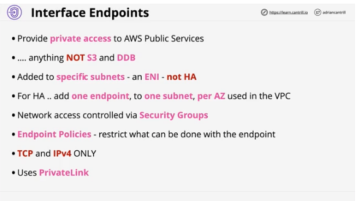

### more concepts

- Gateway endpts use a prefix list
- interface endpts use DNS
- new DNS endpoint name
- given number of DNS names
  - endpoint regional DNS
  - endpoint Zonal DNS
- applications can optionally use these or ...
- PrivateDNS overrides the default DNS for services
- 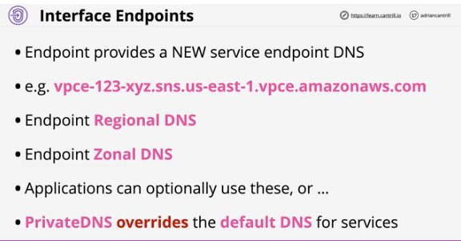

### architecture

- arch example w/o interface endpts
- 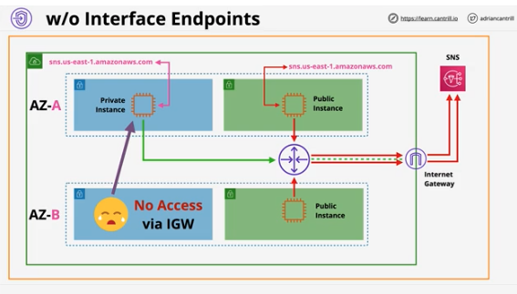
- arch ex w/interface endpts
- 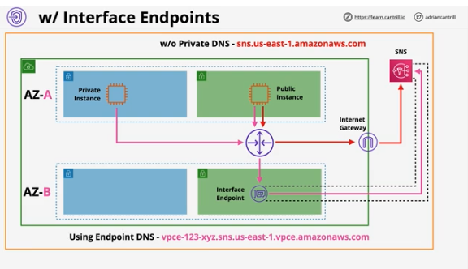
- arch ex w/interface endpts and private DNS
- 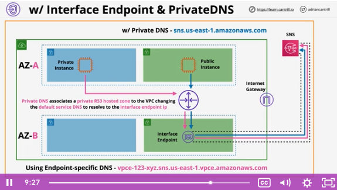

## Demos

#

### summary

### 3 part demo

- part 1: accessing S3 using a gateway endpoint
  - create a gateway endpoint which allow a private instance with a private VPC to connect to S3 service
- part 2: using SNS from a private VPC using interface endpoints
  - implement an interface endpoint to allow access to the SNS service from the private A4L VPC
- part 3: implementing an egress-only internet gateway
  - create an egress only internet gateway to provide the private IPv6 enabled EC2 instance with outgoing access to IPv6 internet

## 5. VPC Peering

#

### summary

- VPC peering is a software defined and logical networking connection between 2 VPCs
- they can be created between VPCs in the same or different accounts and the same or different regions
- this lesson steps through the architectural key points which you will need to understand for the exam and real world usage

### concepts

- service lets you create private encrypted link between 2 vpcs
- no more than 2 vpcs
- same region or cross-region and same/cross account
- optional - public hostnames resolve to private IPs
- same regions SGs can reference peer SGs
- one vpc peer connects 2 vpc peers and only peers
- VPC peering does not support transitive peering
- routing config needed, SGs and NACLs can filter
- 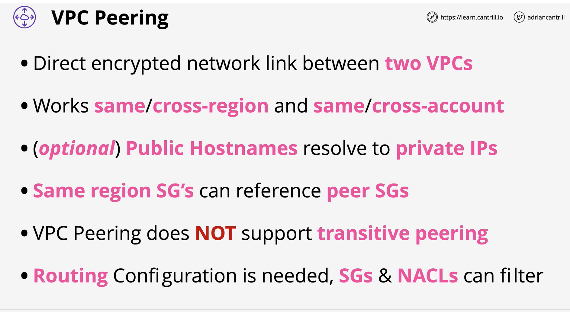

### architecture

- ex: 3 vpcs in A4L
- cannot have overlapping ip addresses in each VPC
- communication is encrypted and transits over the AWS global network when using cross-region peering connections
- 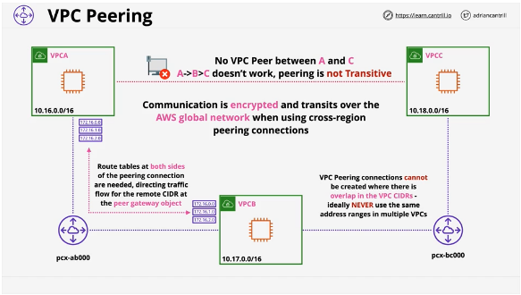

## Demo

#

### Summary

- implementing set of vpc peering connections between 3 private and isolated A4L VPCs
