## 1. Border Gateway Protocol 101

#

### summary

- high level intro to BGP which is used by some AWS services such as Direct Connect and Dynamic Site to Site VPNs

### concepts

- Autonomous Systems are "black boxes". routers controlled by one entity a network in BGP
- Autonomous Systems Numbers are unique and allocated by IANA and are private. 16bit in length. some are private
- operates over TCP port 179 - it's reliable
- not automatic - peering is manually configured
- path-vector protocol. uses ASPATH
- know terms - iBGP and eBGP see slide
- 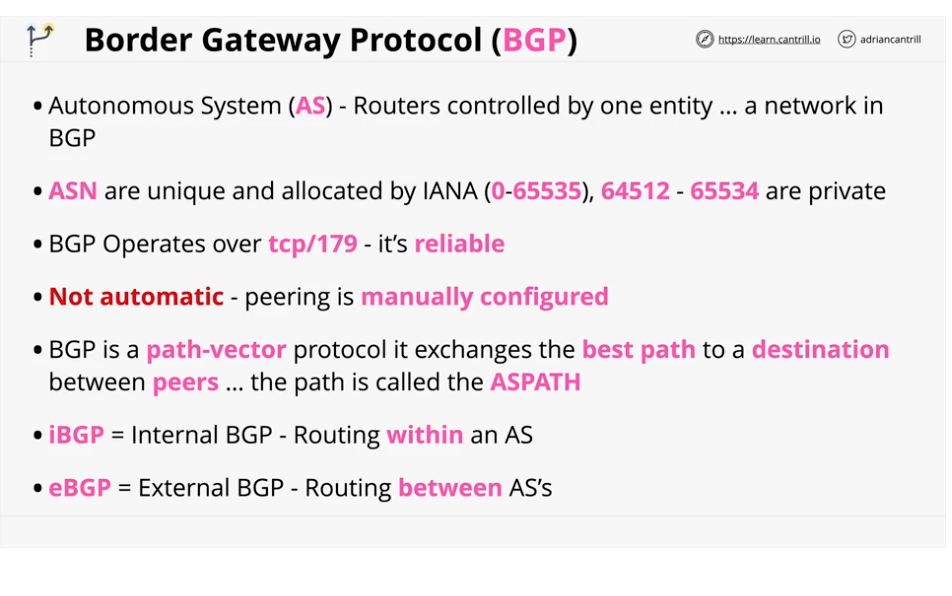

### architecture

- using Australia as a example. see slides and video for detailed explanation
- 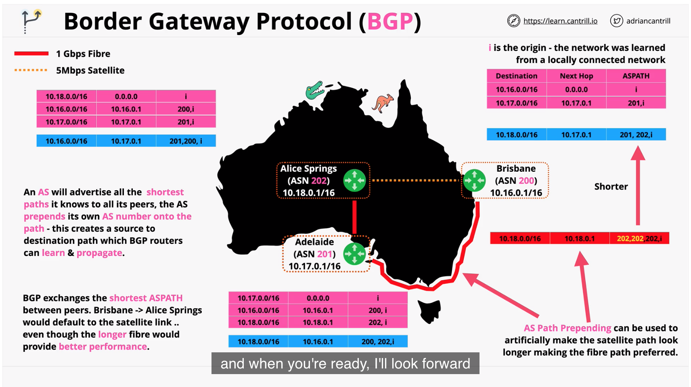

## 2. AWS Site-to-Site VPN

#

### summary

- AWS site to site VPN is a hardware solution which creates a highly scalable IPSEC VPN between an aWS VPN and external netowrk such as on-prem traditional networks
- VPNs are quick to setup vs direct connect, dont offer the same high performance, but do encrypt data in transit.
- this lesson details the concept and arch needed for exam
  [hybrid site to site lesson link](https://learn.cantrill.io/courses/730712/lectures/15532724)

### concepts

- offer quickest way to create a link for AWS env and onprem
- when and where to use for exam
- logical connection between VPC and onprem network
- encrypted using IPSec running over public internet
- can be fully Highly Available if designed/implemented correctly
- quick to provision. can be up/running less than 1 hour
- components:
  - vpc
  - virtual private gateway(VGW)
  - customer gateway(CGW)
  - VPN connection between VGW and CGW
- 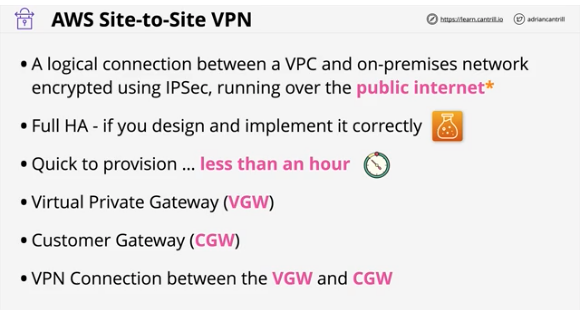

### architecture

- partial high availability, HA on AWS side, not on cust side. see video and slides
- 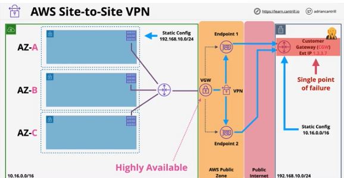
- solution: add another onprem cust router. create another VPN connection that links to VGW. see slide and video
- 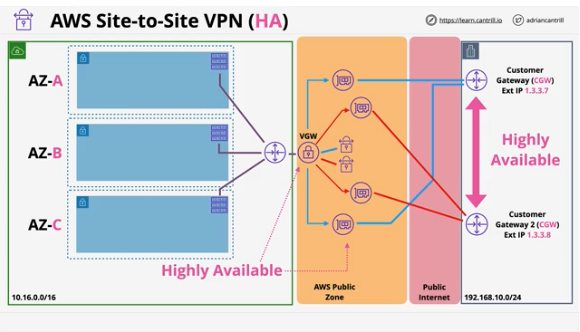

### static vs dynamic VPN (BGP)

#### architecture

- difference is how routes are communicated
- static uses IPsec and must be manually configured
- dynamic uses BGP and lets the routers communicate w/each other
- 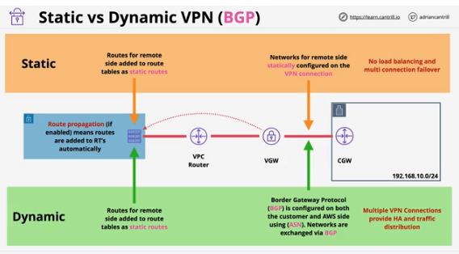

#### considerations

- speed limitations - 1.25Gbps know for exam
- latency considerations - inconsistent, travels over public internet
- cost - AWS hourly cost, GB out cost, data cap(on prem)
- speed of setup - hours or less. all software configurations
- can be used as backup for Direct Connect(DX)
- can be used with Direct Connect(DX)
- 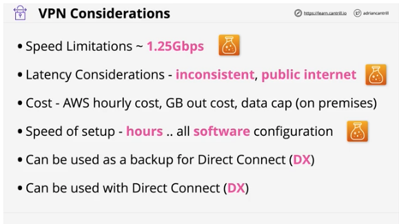

## Demos

#

### summary

#### 2 part demo

1. part 1 - VPC and on-premises VPN part 1

- implement a site-to-site VPN between and onprem location and AWS
- lesson uses a UNIFI CGW - your steps may vary depending on vendor

2. part 2 - VPC and on-premises VPN part 2

- continued

## 3. Direct Connect

#

### summary

- DirectConnect is AWS's physical private link connecting your business premises to it's public & private services
- has pros/cons vs site-to-site VPN and it's impossible to demo w/o using
- lesson teaches theory/arch needed for exam
- [lesson link](https://learn.cantrill.io/courses/730712/lectures/15532730)

### concepts

- like site to site VPN, but actual physical connection to AWS network
- A 1Gbps or 10Gbps network port into AWS
- at a DX location. see slides for physical standard
- cust router is connected at DX location. router must support BGP
- DX basically gives you a part at a DX location. you arrange the connection to that port
- on top of the DX connection, you can run multiple virtual interfaces, known as VIFS
- 2 types - private and public
- encryption not supported by default
- 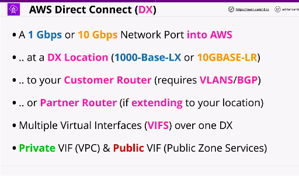

### architecture

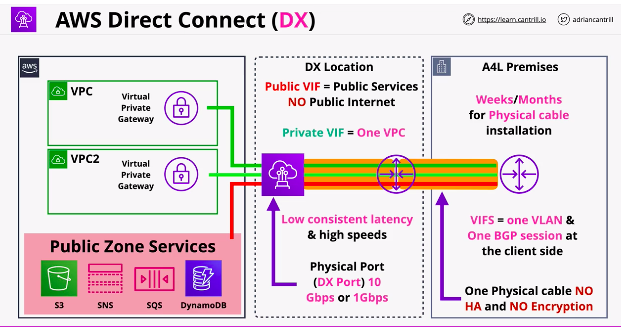

### considerations

- takes much longer to provision vs VPN
- extension to prem can take weeks/months depending on telco company
- DX is faster 40Gbps w/aggregation
- low consistent latency, doesn't use business bandwidth
- NO BUILT IN ENCRYPTION
- 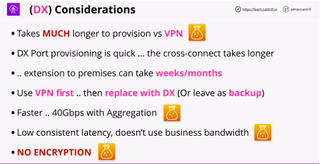

### encryption arch ex

- run an IPsec vpn over the public VIF to encrypt in transit
- 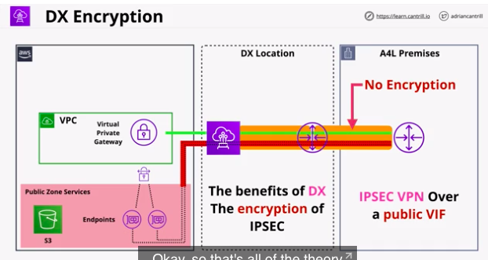

## 4. Direct Connect Resilience

#

### summary

- cover arch of a few resilient applications of DX
- starting w/overview of the default implementation offers no resilience
- [lesson link](https://learn.cantrill.io/courses/730712/lectures/24660629)

### concepts

#### none resilient connection

- architecture w/no resilience
- from AWS to DX connect location, connection is HA and resilient
- at DX location, the customer and DX router is connected via cross-connect
- from the cust router to cust prem is connected via telco
- 7 single points of failure. see slide
- 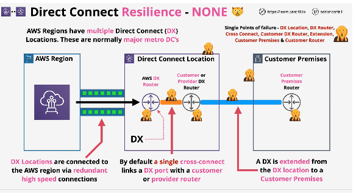

#### resilient connection - ok

- using multiple DX connections. see slide
- still some failure, if DX location fails, but better than before
- 2 single points of failure
- 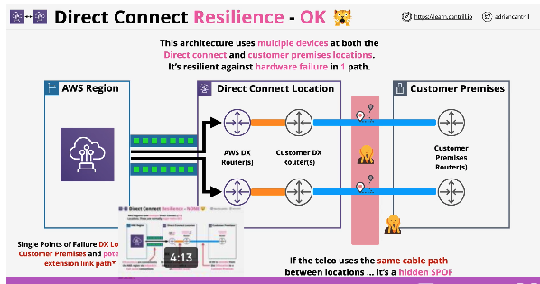

#### resilient connection - better

- 2 independent cust premises
- 2 different DX locations
- see slide for arch ex
- 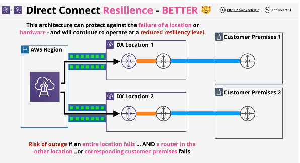

#### resilient connection - great

- 2 dx locations, with 2 ports at each location
- 2 diff cust premises, with 2 routers at each location

- 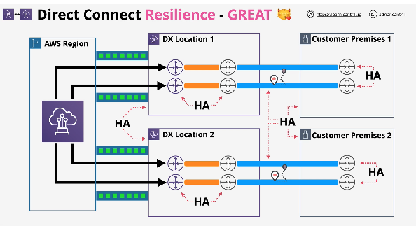

## 5. Transit Gateway

#

### summary

- is a network gateway which can be used to simplify networking between VPCs, VPN, and DX
- can be used to peer VPCs in the same account, different account, same, or different region and supports transitive routing between networks
- this lesson steps though features which allow for a significant reduction in network complexity
- [lesson link](https://learn.cantrill.io/courses/730712/lectures/15532731)

### concepts

- network transit hub to connect VPCs to onprem networks
- reduces network complexity
- single network object - HA and scalability
- VPC, site to site VPN, and DX gateway
- 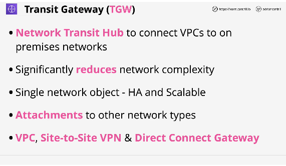

### architecture w/o TGW

- requires connections to everything from each other, mesh network. see slide for example
- 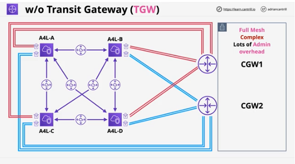

### arch w/TGW

- The TGW acts as a hub(or middleman), of sorts. see slide, compare vs w/o
- acts a interVPC router - HA. see center TGW in slide
- can peer w/other TGWs in other regions and other accounts
- can also connect to DX connect gateway
- supports multiple route tables allowing complex routing architectures
- 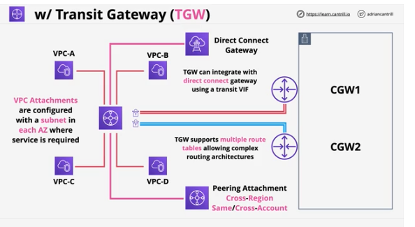

### considerations

- supports transitive routing
- can be used to create global networks
- share between accounts using AWS RAM - resource access mgr
- peer w/diff regions - same or cross account
- less complexity vs w/o TGW
- 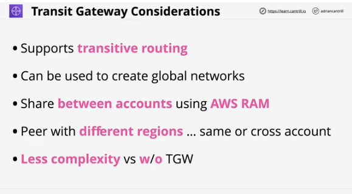

## Demos

#

### 2 part demo

#### implementing advanced hybrid networking using TGW parts 1 and 2

- implement a TGW to connect VPCs and onprem together
- TGW is capable of transitive routing and makes implementing complex hybrid networks easier vs full mesh networks

## 6. Storage Gateway

#

### summary

- storage gateway is a super flexible hybrid storage appliance
- capable of running in 3 modes
  - file
  - tape
  - volume - stored or cached
- understanding the features of each, and when to use those features is a key part of any hybrid infrastructure question on the exam
- [lesson link](https://learn.cantrill.io/courses/730712/lectures/15532734)

### concepts

- can used many diff ways. flexible
- hybrid storage virtual appliance - on prem
- support a few diff scenarios:
  - extension of file and volume storage onto AWS
  - volume storage backups into AWS
  - tape backup existing solutions into AWS
  - migration of existing infrastructure to AWS
- 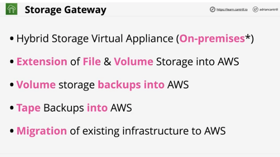

### runs in 3 modes

- tape gateway(VTL) mode
  - stores virtual tapes on S3 and Glacier
- file mode - SMB and NFS
  - maps files to S3 objects
  - file storage backed by S3 objects
- Volume mode (Gateway cache/stored)-iSCSI
  - block storage backup by S3 and EBS snapshots
- 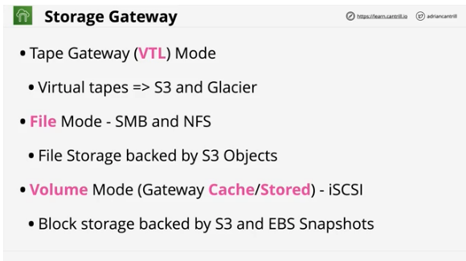

### architecture

#### file gateway arch

- 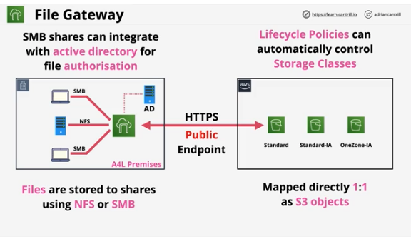

#### Tape Gateway arch

- stores in S3 and Glacier
- 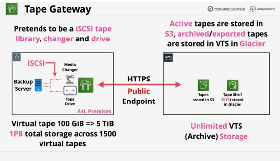

#### volume gateway - stored

- creates EBS snapshots
- exceptional for DR and migrations
- data is stored locally, AWS is backup
- 

#### volume gateway - cached

- cached mode is for extensions into AWS
- when capacity is limited and you want to decomission
- data not stored locally, uploaded to AWS stored on S3 backup volume
- 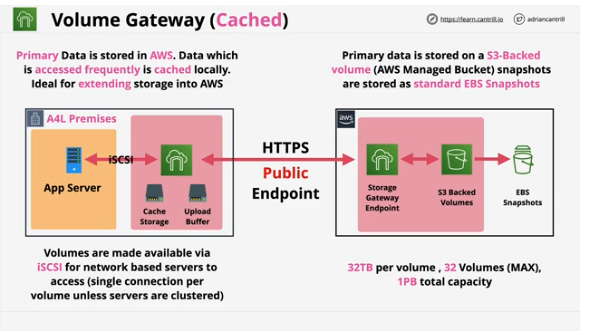

## 7. Snowball/Edge/Snowmobile

#

### summary

- snowball, snowball edge, and snowmobile are three parts of the same product family designed to allow the physical transfer of data between business locations and AWS
- knowing which to pick and why it's essential for the solutions architect exam
- [lesson link](https://learn.cantrill.io/courses/730712/lectures/15532735)

### concepts

- move large amts of data in/out of AWS
- physical storage either suitcase or truck
- can order empty, load, return
- order w/data, empty, return
- for exam, now use cases
- 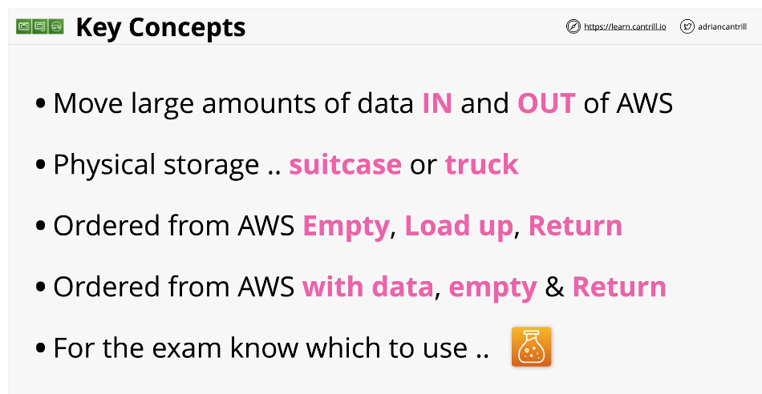

### architecture

#### Snowball

- physical device ordered from AWS, log a job, not instant
- data encrypted using KMS
- capacity: 50TB or 80TB
- 1Gbps or 10Gbps
- 10Tb to 10Pb economical range - makes it worth it
- can order multiple devices, sent to multiple locations if needed
- only includes storage - no compute capability
- 

#### Snowball edge

- both storage and compute
- larger capacity vs Snowball
- faster networking see slides for stats
- 3 types:
  - storage optimized. see slide
  - compute optimized. see slide
  - compute w/GPU
- ideal for remote sites where data processing on ingestion is needed
- 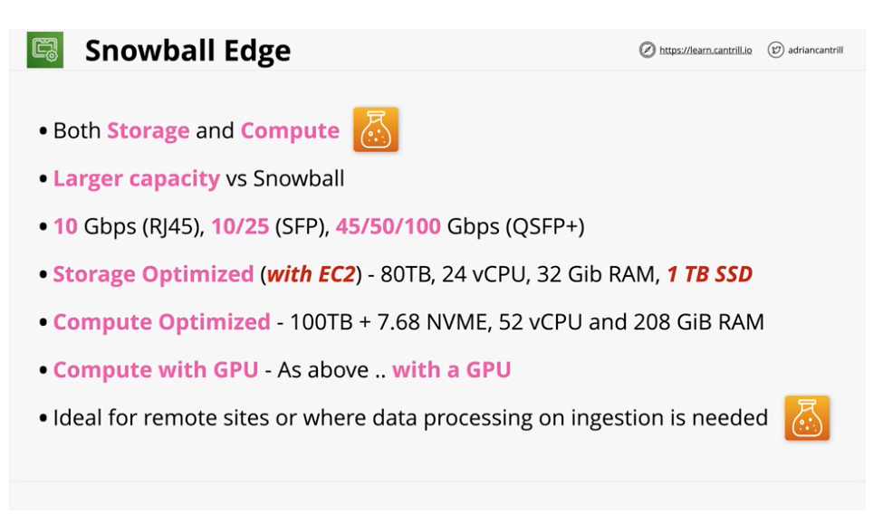

#### Snowmobile

- portable data center inside a shipping container on a truck
- literally a truck
- special order
- single location w/huge amts of data to ingest to AWS
- ideal for location when 10PB+ is required
- up to 100PB per snowmobile
- not economical for smaller than 10PB or mulit-sites unless huge
- 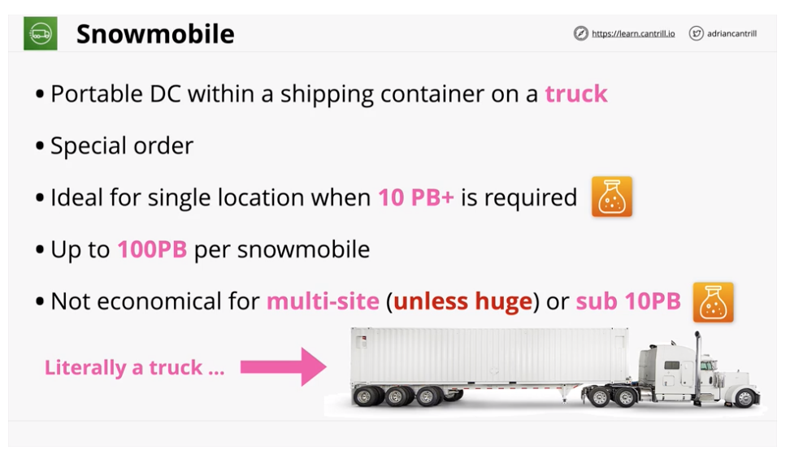

## 8. Directory Service

#

### summary

- product which provides managed directory service instances within AWS
- functions in three modes:
  - Simple AD: implementation of Samba 4
  - AWS managed Microsoft AD: actual MS AD DS implementation
  - AD Connector: proxies requests back to an onprem directory
- lesson steps through the architecture of the service and use cases for each
- [lesson link](https://learn.cantrill.io/courses/730712/lectures/15690951)

### concepts

- a managed directory, store of users, objects, and other configurations
- directories:
  - store objects - users, groups, computers, servers, file shares within a structure(domain, tree)
  - multiple trees can be grouped into a forest
  - commonly used in windows environment
  - sign into multiple devices with same username password
  - commonly used: Microsoft Active Directory Domain Services
  - open source alternative: open-source alternatives(SAMBA)
- 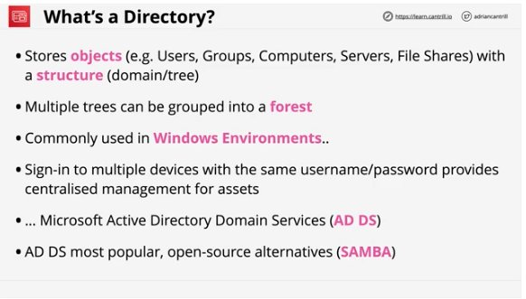

### architectures

#### AWS Directory Service

- AWS managed implementation
- runs within a VPC - private service
- to implement HA deploy into multiple AZs
- some AWS services need a directory - example: Amazon Workspaces
- can be isolated or integrated with existing onprem system
- or act as a proxy back to your onprem
- 

#### architecture - Simple AD Mode

- cheapest way to run
- meant to run in isolation
- 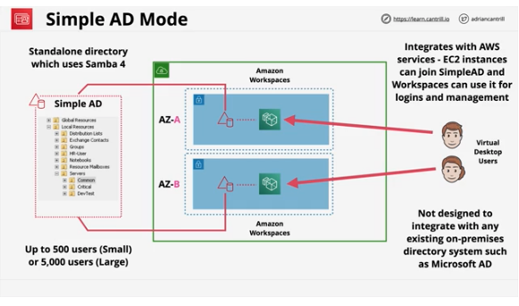

#### architecture - Managed Microsoft AD Mode

- designed when you have onprem env and want AWS presence
- can create trust relationship between AWS presence and onprem AD
- resilient if the VPN fails
- 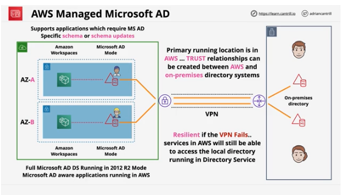

#### architecture - AD connector

- on prem directory already, and you dont want to create a new one
- establish private connection your onprem and AWS
- create a VPN between AWS and your onprem
- is only a proxy used to integrate with AWS services
- no local functionality
- 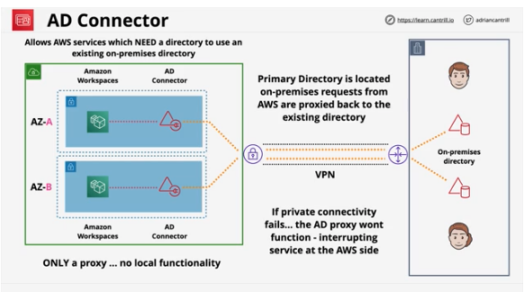

### picking between modes

- simple AD - the default. simple requirements
- Microsoft AD - when applications in AWS need MS AD DS or you need a trust relationship
- AD Connector - use AWS services which need a directory without storing any directory info in the cloud
- 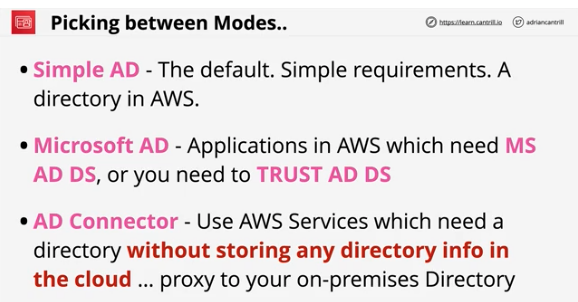

## 9. DataSync

#

### summary

- product which can orchestrate the movement of large scale data(amounts or files) from on-premises NAS/NAS into AWS or vice-vera
- [lesson link](https://learn.cantrill.io/courses/730712/lectures/15690952)

### concepts

- need to be aware of what it is, what it does, and use cases
- data transfer service to and from AWS
- manages process end to end
- used for migrations, data processing transfers, archival, DR, BC
- designed to work at huge scale
- uses agents and jobs
- keeps metadata ex: permissions, timestamps
- built in data validation
- 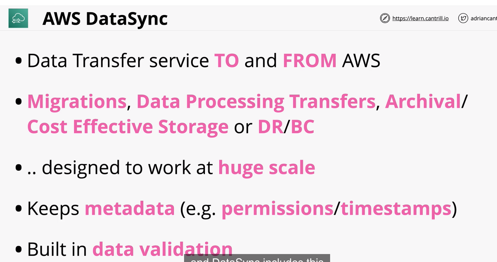

### key features

- scalable - 10Gbps per agent
- bandwidth limiters (avoids link saturation)
- incremental and scheduled xfer options
- compression and encryption
- automatic recovery from transit errors
- AWS service integration - S3, EFS, FSx
- pay as you go, per gb cost
- 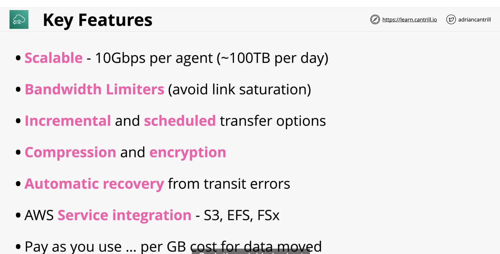

### architecture

- onprem left, AWS region right
- NAS onprem needs to move to AWS
- install datasync agent on prem server
- communicates with datasync endpt on AWS
- data can be stored on AWS services
- can be scheduled and/or bandwidth limit
  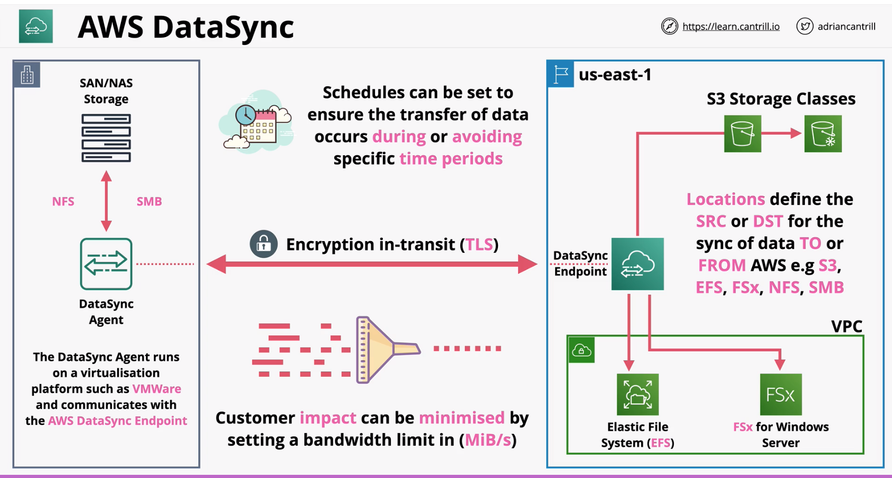

### components

- task - job within datasync. what, how, from, where
- agent - software used to read/write to onprem data stores using NFS or SMB
- location - every task as 2 locations. from/to
- 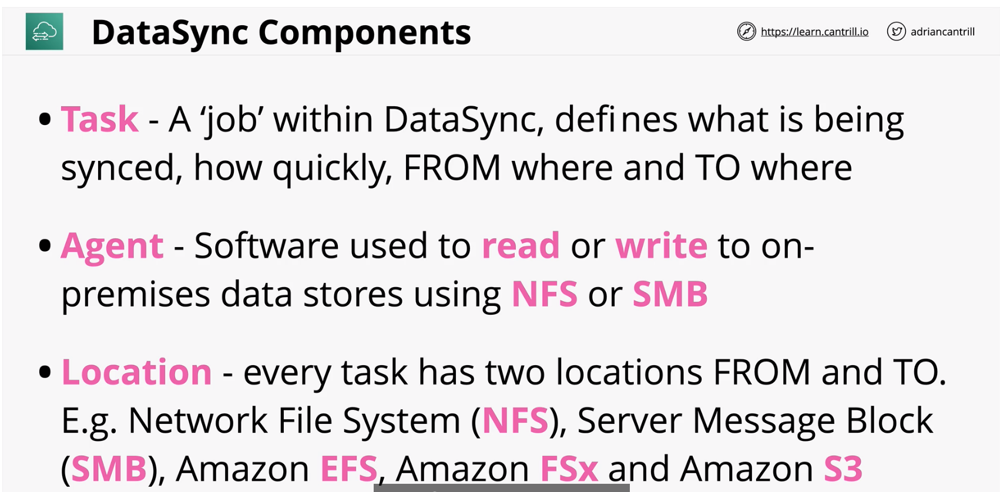

## 10. FSx for Windows Servers

#

### summary

- FSx for Windows Servers provides a native windows file system which can be used within AWS or from onprem environments via VPN or Direct Connect
- FSx is advanced share file system accessible over SMB and integrates with Active Directory(either managed or self hosted)
- it provides advanced features such as VSS, data de-duplication, backups, encryption at rest, and forced encryption in transit
- [lesson link](https://learn.cantrill.io/courses/730712/lectures/15749267)

### concepts

- supports windows env in AWS
- fully managed native windows file servers/shares
- designed for intergration w/windows environments
- integrates with Directory Service or self-managed AD
- single or multi-AZ within a VPC
- on-demand and scheduled backups
- accessible w/in VPC, Peering, VPN, Direct Connect
- accessed using SMB protocol
  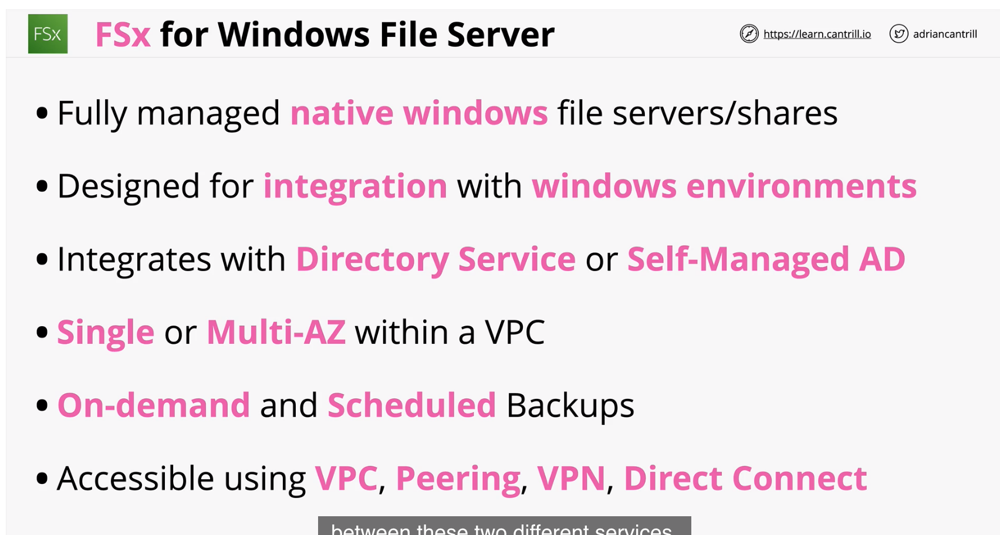

### architecture

- vpc on left, cust prem on right. connected via DX or VPN
- 

### FSx Key Features and Benefits

- VSS - windows feature allows users to file level restores
- native file system accessible over SMB
- uses windows permission model
- supports DFS...scale out file structure
- managed - no file server admin
- integrates w/DS and your own directory
- 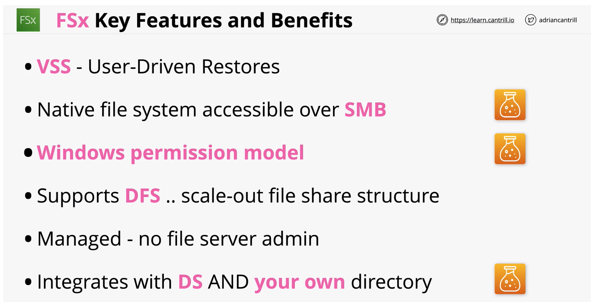

## 11. FSx For Lustre

#

### summary

- managed file system which uses FSx product design for high performance computing
- delivers extreme performance for scenarios such as big data, ML, financial modeling
- [lesson link](https://learn.cantrill.io/courses/730712/lectures/22586267)

### concepts

- relatively niche products, know use cases
- managed Lustre - designed for HPC-Linux clients (POSIX)
- 100s GB/s throughput and sub-millisecond latency
- 2 deployment types: Persistent or Scratch
- Scratch - highly optimized for short term, no replication
- persistent - long term, HA, self healing
- accessible over VPN or DX (direct connect)
  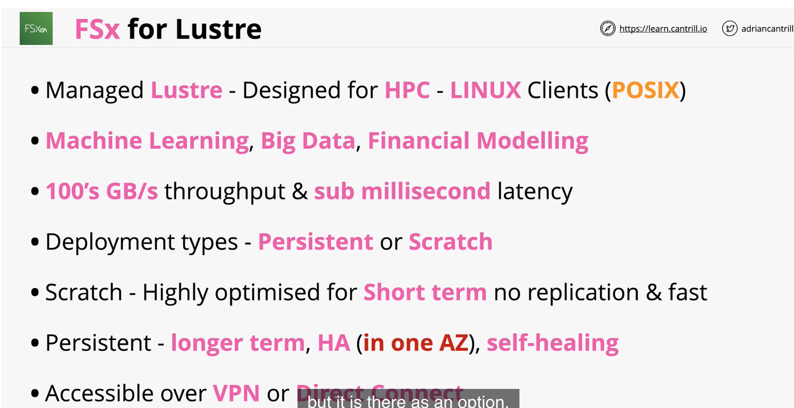

### architecture overview

- data is lazy loaded the first time from source to FSx
- no synchronization
- you cn sync using HSM_archive command
- not automatically in sync
  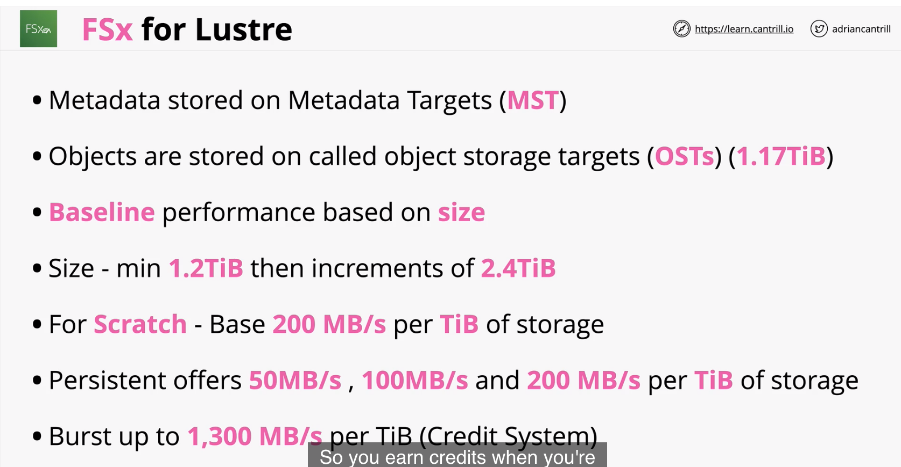

### architecture key points and visual

- metadata stored on metadata targets(MST)
- objects are stored on called object storage targets
- baseline performance based on size
- size min increments on slide
- uses Elastic Network Interface
- 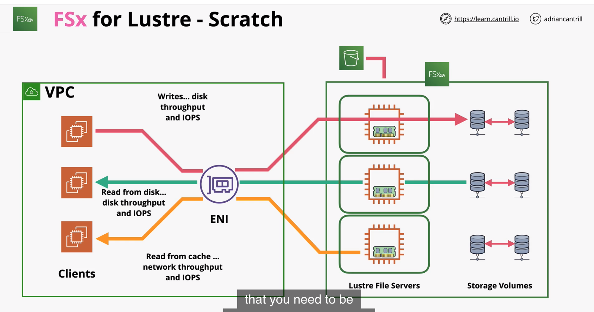

### key points

- Scratch is designed for pure performance
- short term or temp workloads
- no HA no replication
- larger file systems means more servers more disks and more chance of failure
- persistent has replication within one AZ only
- auto heals when hardware failure occurs
- you can bckup to S3 with both! manual or automatic
  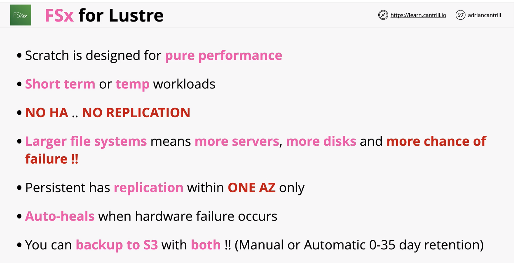
