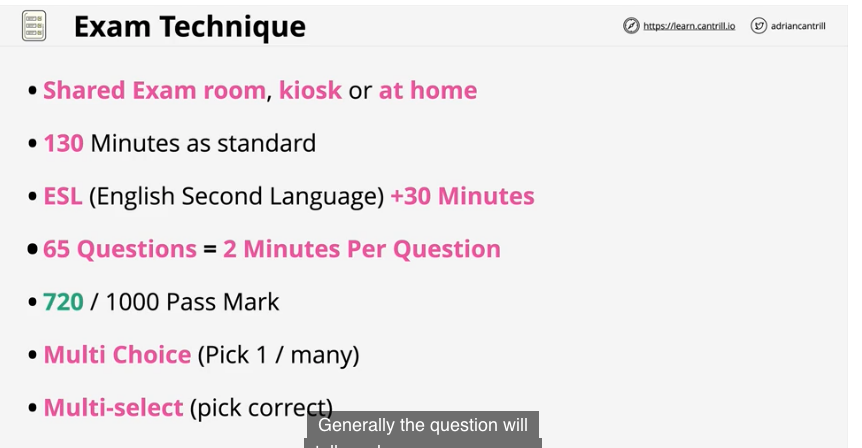
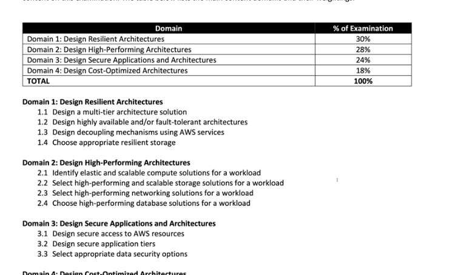
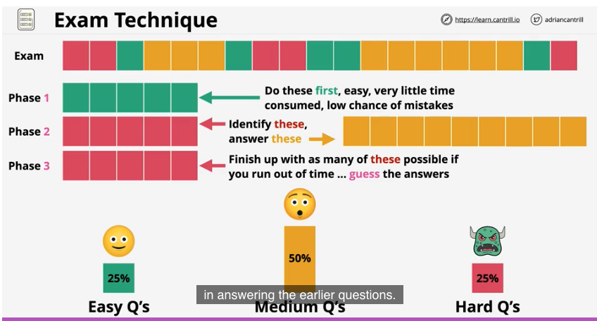
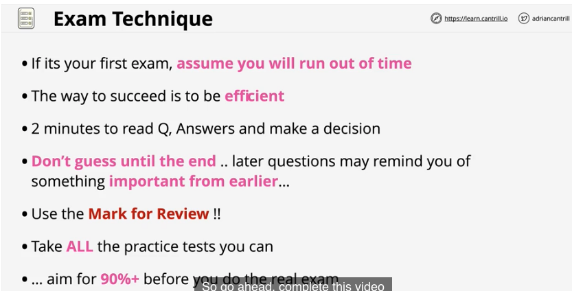
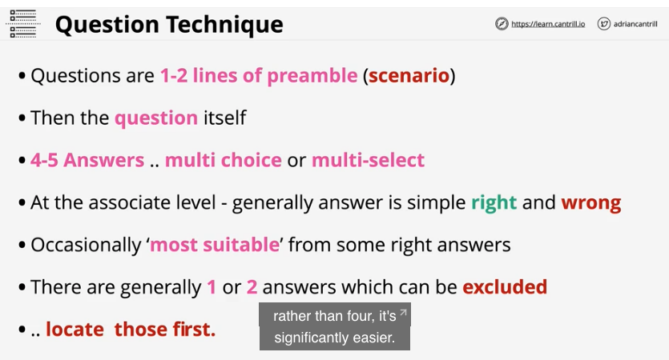
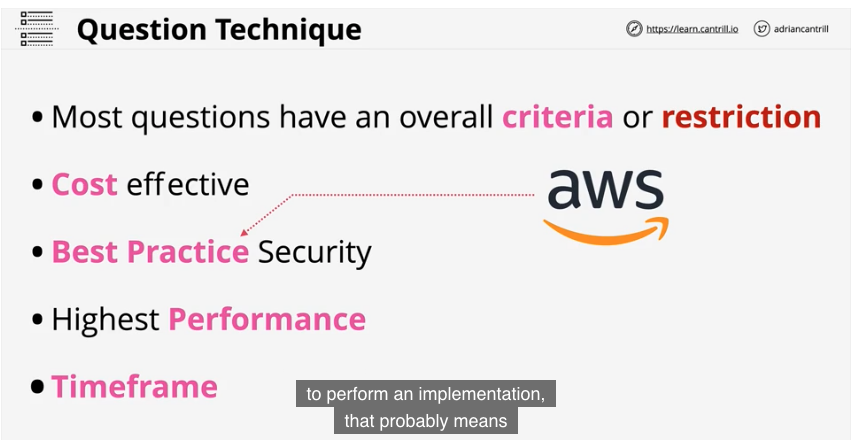
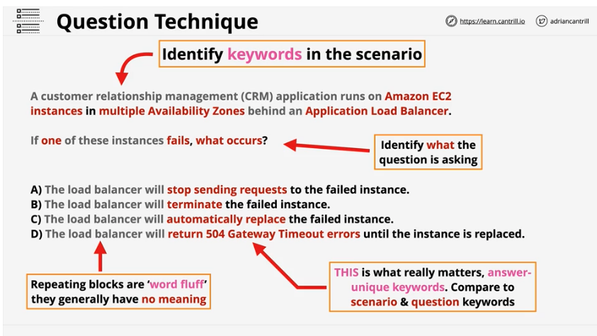
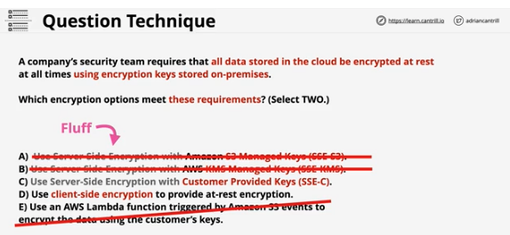
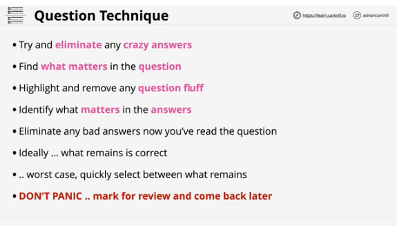

## 1. Exam Technique

#

### summary

- lessons steps through experiences and suggestions for handling the exam in a structured and efficient way
- focuses on the exam itself and questions specifically in the following lessons
- [lesson link](https://learn.cantrill.io/courses/730712/lectures/16015227)

### about the exam

- can take exam in 1 of 3 ways
  - shared exam room, kiosk, or at home
- exam is 130 minutes
  - ESL +30 minutes
- 65 questions = 2 minutes/per question
- min passing score 720/1000
- initially only told if you pass/fail. few days later you'll receive score details
- multiple choice or multiple select
- 

### test domains

- test is broken down into domains
  - 1 - design resilient arch 30% of exam
  - 2 - design high performing arch 28%
  - 3 - design secure applications and arch 24%
  - 4 - design cost optimized arch 18%
- 

### test difficulty

- 25% easy questions
- 50% medium
- 25% hard
- order will be random
- 3 phase approach
  - phase 1 go through all the 65 questions and do the easy ones first
  - phase 2 go through whatever remain, try to identify hard questions, flag them, but answer the medium questions
  - phase 3 hard questions last, focus on these with what time you have left
- 

### final hints and tips

- assume you will run out of time
- way to succeed is to be efficient
- 2 minutes to read Q, answers, and make decision
- don't guess till the end. later questions may remind you of something important from earlier
- use the "mark for review" feature
- take all the practice tests you can
  - www.tutorialsdojo.com
- aim for 90% + on the practice exam
- 

## 2. Question Technique part 1

#

### summary

- how to approach questions in the exam
- [lesson link](https://learn.cantrill.io/courses/730712/lectures/16016305)

### question breakdown

- 1-2 lines of preamble(scenario)
- then the question itself - usually brief
- 4/5 answers....multiple choice or multiple select
- at associate level, generally answer is right/wrong
- occasionally some answers are "most suitable"
- generally 1 or 2 answers that can be excluded
  - locate those first
- 

### question breakdown slide 2

- most questions have an overall criteria or restriction
  - cost effective for example
  - the term "Best Practice" -> do what AWS wants you to do
  - term "Highest Performance"
  - term "Time Frame"
- 

### sample question

- identify key words in red
- identify what's missing
- identify what the question is asking
- look for word fluff
- look at the key words, they matter
- 
- correct answer is A

## 3. Question Technique part 2

#

### another example question

- multi-select question
- identify wrong answers
- identify what matters in the question text - in red
- look for key words and word fluff
- 
- correct answers: C and D

### hints and tips

- try to eliminate crazy answers
- find what matters in the question
- highlight remove word fluff
- identify what matters in the answers
- eliminate bad answers
- worse case select between what remains
- dont panic
- 

## 4. Practice Quiz #1

#

### summary

## 5. Practice Quiz #2

#

### summary
