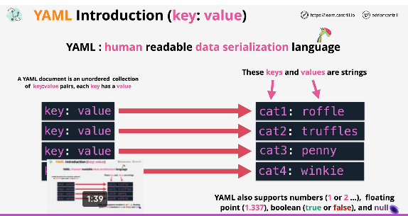
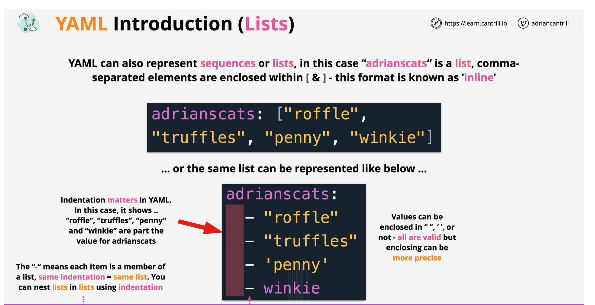
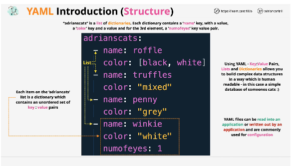
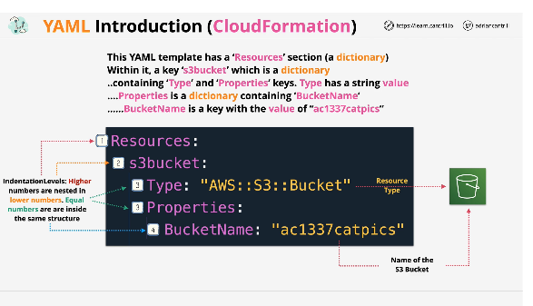

### summary

- recursive acronym for "YAML ain't markup language" is a human readable data serialization language
- commonly used for configuration files and in applications where data is being stored or transmitted
- used within AWS as one of two supported CloudFormation template formats
- [lesson link](https://learn.cantrill.io/courses/730712/lectures/27415250)

### concepts

- human readable data serialization language
- key:value pair
- supports multiple types: arrays, integers, floats, booleans, etc
- supports inline formatting
- indentation matters - using spaces
- supports dictionaries
  - each list item has key/value pairs. see slide for example
- can be used in cloudformation templates

### slides

