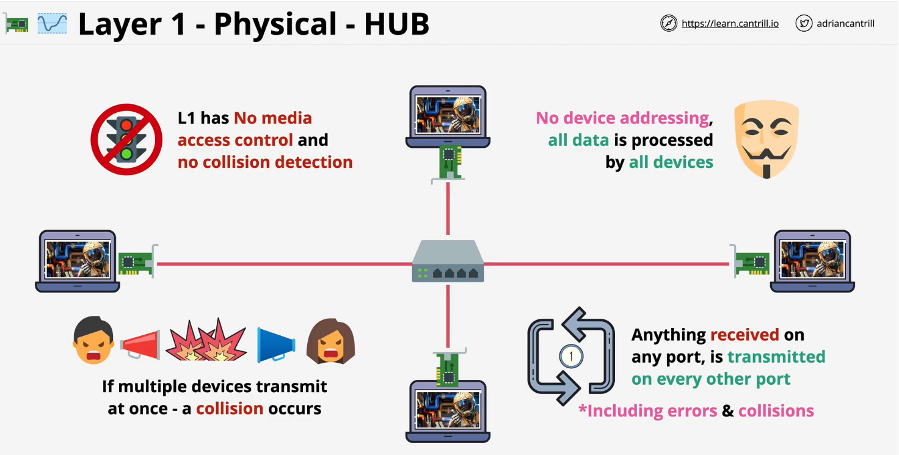

1. Physical Layer is how devices are connected together
   - focuses on physical shared medium
   - can be copper, fiber, wifi
   - defines standards of how raw data streams between a shared physical medium
2. networking device used is a **HUB**
   - Hubs are dumb. just repeats signal everywhere
   - including errors and collisions
   - no device addressing
   - like shouting into a room without knowing specific name

