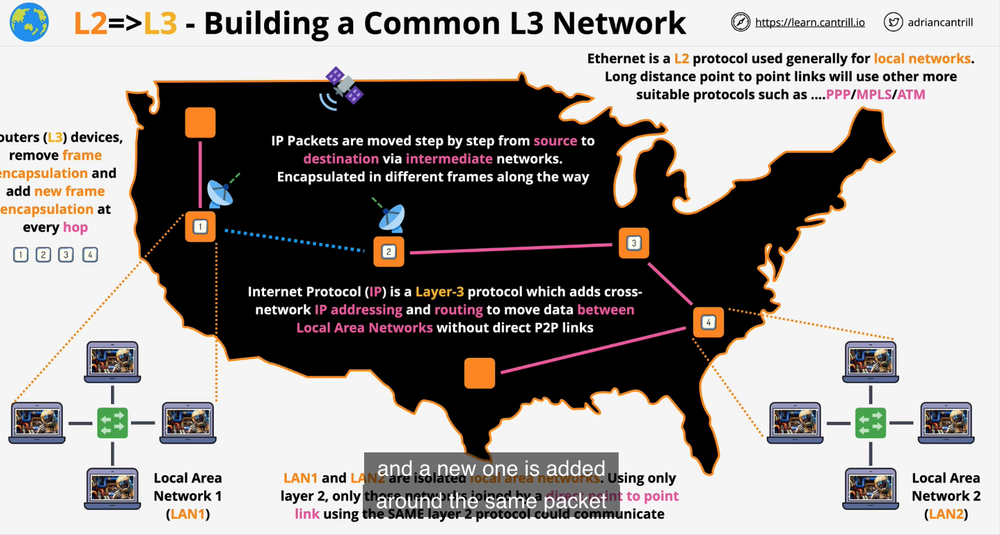
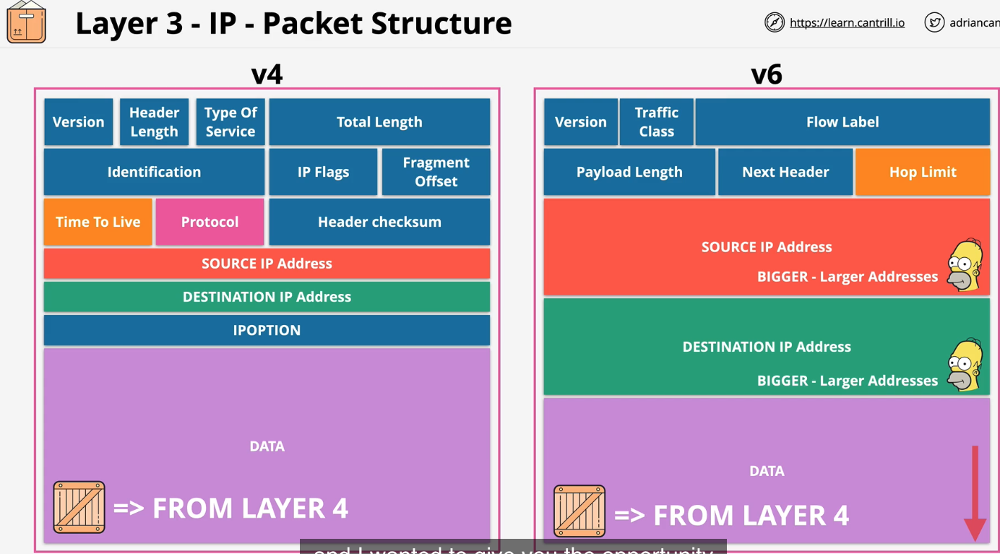

## Network layer

- network device is a **ROUTER**
- Frames contain IP **PACKETS**
- job is to get frames from one location to another

  - 

- packets have destination/source IP address
- IP4 vs IP6
- packets contain data, source/destination IP address, TTL, protocol(layer 4, ex tcp/udp/icmp)

  - 

## Part 2

- to be continued